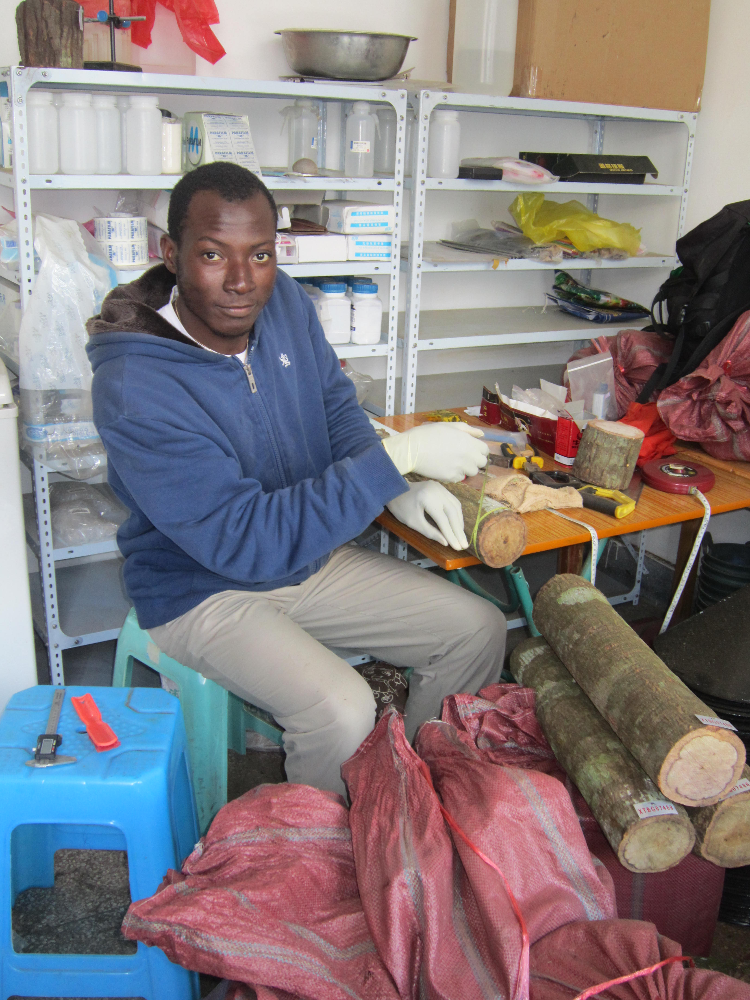

```{r setup, include=FALSE}
knitr::opts_chunk$set(echo = TRUE)
```


***Questions:***
In this current exercise, you are asked:

1. Please give "My first R Markdown document" as your document title, construct your first R markdown document that reproduces exactly the formatting of the workshop introduction first paragraph document at [click here](https://dossag.github.io/reproducible-science-afec-x-2021/) by replacing Dossa's information by your own (e.g., replace **Dossa** by **your_name**). Make sure you put in italic what should be in italic and in bold what you should be in bold;

2. Give first level heading "Photos":

    2.1. Give second level heading ("My institute logo: full size"), download the logo of your current institute and add it in your R markdown document as a big size ;

    2.2. Give second level heading ("My institute logo: small size), repeat the previous question but by this time reducing the size of the photo output;

    2.3. Give second level heading ("My personal photo") to add a photo of yourself but here add a caption as follows (Figure 3: Photo of "your_name");

3. Give first level heading ("Tables")

    3.1. Give a second level heading ("Table by hand") Include by hand a table of at of three column named ("Names", "Sex") and at least 2 rows, fill in rows the names of yourself, your peer's names,and the name of supervisor or your current boss; the sex of each person, the highest degree of each person, the height of each person;


    3.2. Add an inline code that renders the mean height of all persons included in your table;

    3.3. Give second level heading ("Table with RMarkdown generator"), include the same table as above but by using [RMarkdown table generator]();
[Please put the content of the table in **right alignment**]

4. Give first level heading ("Reading paper") 
Introduce the name of your article you read of first day in put this title in bold with the name of the first author in italic. Make sure you attach a link to it the title so at a click we can get to the online version of that article

5. Give a first level heading ("Conclusion")

Add the quote you have from your article in italic and write  the last sentence. "Now, i am close to adopt reproducibility and I am proud of myself" 

6. to knitr your document to get a ***html*** document.


7. Save the html as "your_name_exo3.html"and share on our wechat group.


***Answers***

# **Q1: see the yaml part**

# **Q2: Photos**
## **Q2.1:My institute logo: full size**

First make sure you downloaded your institute logo and save in the same directory as your rmarkdown document. Then, include the photo.

### **Logo in full size**


### **My institute logo: small size**

For adding small size logo, you need not to reduce the size by hand in another software but just use the following syntax.

```{r, echo=FALSE,out.width='20%', fig.align='center', fig.cap='Small size of xtbg logo', include=TRUE, results="hold"}

```

### **Personal photo**
```{r, echo=FALSE,out.width='50%', fig.align='center', fig.cap='Figure 3: Photo of Dossa', include=TRUE, results="hold"}

```


# **Q3: Tables**

## **Table by hand**

Use := for left-aligned, :=: for centered, =: for right-aligned columns.

(==) to separate the first row to the other
(--) to separate other rows

Left alignment (:=)

+--------+------+------------+-------------+
|Names   |Sex   |Education   |Height (m)   |
+:=======+:=====+:===========+:============+ 
|Dossa   |M     |Ph.D.       |1.86         |
+--------+------+------------+-------------+
|Rhett   |M     |Ph.D.       |1.82         |
+--------+------+------------+-------------+
|CaoKF   |M     |Ph.D.       |1.65         |
+--------+------+------------+-------------+

Right alignment (=:)

+--------+------+------------+-------------+
|Names   |Sex   |Education   |Height (m)   |
+=======:+=====:+============+============:+ 
|Dossa   |M     |Ph.D.       |1.86         |
+--------+------+------------+-------------+
|Rhett   |M     |Ph.D.       |1.82         |
+--------+------+------------+-------------+
|CaoKF   |M     |Ph.D.       |1.65         |
+--------+------+------------+-------------+

Center alignment (:=:)

+--------+------+------------+-------------+
|Names   |Sex   |Education   |Height (m)   |
+:======:+:====:+:===========+:===========:+ 
|Dossa   |M     |Ph.D.       |1.86         |
+--------+------+------------+-------------+
|Rhett   |M     |Ph.D.       |1.82         |
+--------+------+------------+-------------+
|CaoKF   |M     |Ph.D.       |1.65         |
+--------+------+------------+-------------+

## **Add an inline code for mean height**

The average height of all members  of my group is `r round(mean(c(1.86, 1.82, 1.65)), 3)`


## **Table with RMarkdown table generator**
|Names   |Sex   |Education   |height   |
|---|---|---|---|
|Dossa   |M   |P   |  300 |
|Rhett   |M   | P  |  100 |
|CaoKF   |M   | P  |90   |

[R Markdown table generator](https://www.tablesgenerator.com/markdown_tables)

|Names |Sex   |Education   |Height (cm)  |
|---|---|---|---|
| Dossa  |M   |Ph.D.   |1.86   |
| Rhett  |M   |Ph.D.   |1.82   |
| CaoKF  |M   |Ph.D.   |1.65   |

# **Q4: Reading paper** 

I read an article entitled [**Five selfish reasons to work reproducibly**](https://genomebiology.biomedcentral.com/articles/10.1186/s13059-015-0850-7) by _Markowetz_ 

# **Q5: Conclusion**

Here is a quote from the above article: *"Science is becoming more transparent and reproducible every single day. You can be a leader in this process! A cutting-edge trend-setter! Come on, I know
you want it too."* by Markowetz 2015 Now, i am close to adopt reproducibility and I am proud of myself. 

# **Q6 to knitr your document to get html document**

# **Q7 save document**

