```{r setup, include=FALSE}
knitr::opts_chunk$set(echo = TRUE)
```

# Exercise 4 Git Github Good enough workflow

## Setting up Reproducible Workflow

*This exercise was modified from [Rob Schick's materials](https://nicholas.duke.edu/people/staff/schick-phd) taught at a workshop at ESA 2017.*
Please before you continue, kindly go to [workshop site](https://dossag.github.io/reproducible-science-afec-x-2021/) and download the Bahamas Marine Mammal Research Organization data set call bbmroData.csv under the menu worksheet *Exercise 4 bbmroData.csv*.

Start by navigating to a folder that will serve as the host of the main repository, e.g. /rob/research/projects
Once there, replicate this folder structure.

```{r, echo=FALSE,out.width='100%', fig.align='center', fig.cap='Figure 1', include=TRUE, results="hold"}
knitr::include_graphics('9 Goodenough.png')
```


I recommend doing this on the command line first (e.g., git bash), just to get some familiarity, but if you want to do it with Windows Explorer or Finder, that’s fine too. Here are the folders:

```{}
mkdir myrepo
cd myrepo
mkdir doc
mkdir src
mkdir results
mkdir data
Now make some files at the root level of the directory:
touch LICENSE
touch README
touch CITATION
touch requirements.txt
```

Ok - all done - for now. Let’s talk about what goes into each, and then we’ll start to populate the folders a
bit.

## Start With Raw Data

I’ve given you a raw dataset from the Bahamas Marine Mammal Research Organization. They are in csv format. Download them from box, and put them into your data folder. You can look at them with the head command. Note where you are on the command line first, otherwise you may be looking for data in all the wrong places.

```{}
head bbmroData.csv --lines=2
```

## A Few Scripts

Ok, at this point we have a file structure, and raw data - nothing else. But let’s keep going with a simple R
script to read in the data. Make a script in the src folder and call it something clever like readData.R Try
this first on the command line.

```{}
touch readData.R
```

While we’re at it, let’s make three more empty files:

```{}
touch summarizeData.R
touch plotData.R
touch runRegression.R
```

And then we’ll make a controller script, since that will be useful.

```{}
touch runAll.R
```

That will make the files, but they’re going to be empty just now.


# Git & R 

Awesome. Now we’re ready to move things along with git somewhat. At this point, we’ve made a structure
that’s consistent, and can form the basics of a reproducible workflow. We’ve talked about one way to manually track the changes of the whole project - namely taking the whole structure, and putting it into a folder witha date-specific name, e.g. 20170-08-06-contents-of-myRepo
This can work, and is not a bad setup, but it requires a lot of intervention and consistency on the part of
you the project organizer. One other drawback - in my mind - is that with more than one user and/or more
than one computer, it’s very hard to scale. Things can get complicated and out of phase/sync quickly. The
solution? A modern version control system; here we’ll explore git 

git was written by Linus Torvalds - the creator of Linux. It was an outflow of bitkeeper, and was built to manage the linux kernel. Undoubtedly this is a bigger project than you or I will ever work on. At present
the kernel is approximately 17 million lines of code, with 2-3 thousand contributing developers. No wonder
they need a robust system. We’ve talked about what git is in the lecture, and now we’ll start to put it into
practice.
Let’s cd into the src directory. Type pwd just to make sure you are where you think you are. Then let’s
initialize the repository:

```{}
git init
```

If successful, all you’ll get a message indicating that you have initalized am empty repository. Success!

Next let’s look at the status:
```{}
git status
```

You will see a message about being on branch master (or main), that you are on the initial commit, and that there is nothing to commit. Ok, so what now? 

Let’s add a file to the staging area. Recall that there are three states
of git:

1. the working directory

2. the staging area

3. and the git repo itself - i.e. where things end up when you commit

Right now we are in the staging area, and we should have 5 *.R files - 4 that will do something eventually,
and one that will run all the others. Let’s add the first one readData.R (or whatever you named the file to
read in the data).


```{}
git add readData.R
```

You should get nothing back - just the command prompt again. But if you ask for the status again, you’ll see
something different:

```{}
git status
```


Now that we’ve added a file to the staging area, we should see a message indicating there are changes to be
committed, and it should label what the new file is. On my computer it looks like this:
Now that we’ve added it, let’s run our first commit:

```{}
git commit -m "First Check-in of readData.R script"
```

Now we get some more information back from git about this commit, including the all-important sha-1
identifier. Here you only see the abbreviated sha-1, but if you type git log you’ll see the full sha-1:

```{}
git log
```

```{r, echo=FALSE,out.width='100%', fig.align='center', fig.cap='Figure 2', include=TRUE, results="hold"}
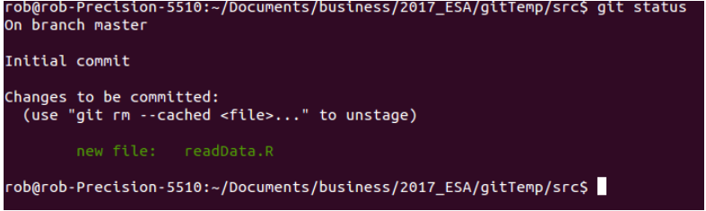
```

Along with who made the commit (hopefully you), the date, and the commit message. Now let’s do some comparison between git and the file system. Right now we have several R scripts in the directory. What do you think you’ll get when you type these commands?
Think what the answer will be before you issue the command.

```{}
ls
```

```{}
git ls-files
```

Why the difference? What do you think you’ll see if you ask for the status? Think before you issue the
command:

```{}
git status
```


If you have untracked files, why is it that git knows about them?

## Going through the cycle again

Let’s edit the file now to actually read in the data. You can do this in vi (it is my text editor), or in the text editor of your choice.

Here’s what I added to mine (recall the tip to put at least a barebone comment at the start of the script):

```{r, results='hide'}
#' This script will read in raw data from the Bahamas Marine Mammal Research Organization
#' into a data frame called whales. whales will serve as the intermediate data for
#' subsequent analysis
whales <- read.csv(file = 'bbmroData.csv') 
## Remember your data should be in subfolder data, data/bbmroData.csv
head(whales)
```

Now we have some new code, i.e. the file has been modified. So go back to the command prompt, and type:

```{}
git status
```

What do you see, and why is it different from whatn you issued git status a few lines back? What do you do
next if you want to make a snapshot (commit) of the updated file? Add it and commit it, but this time we
can do what is called an express commit. Because git already knows about readData.R we can combine the
add and the commit steps:

```{}
git commit -am "Add Code to Ingest the Raw Data"
```

But, this can only be done for files that have already been added.

Let’s go ahead and add all of the remaining untracked files and commit them:

```{}
git add .
git commit -m "Add Remaining Blank R Files"
git status
```


Your last command should indicate that you have a clean repo. Cool!

## Git Log

Now that we’ve made a few commits, we can start to look at how our project is evolving. Git log is a good
way to do this; we’ve seen this before, but now we’ll see a bit more


```{}
git log
```

This is a very flexible command, however, and there are a few ways we can clean it up to make the output a
bit tidier (Figure 3):

```{}
git log --oneline --decorate --graph
```

```{r, echo=FALSE,out.width='100%', fig.align='center', fig.cap='Figure 3', include=TRUE, results="hold"}
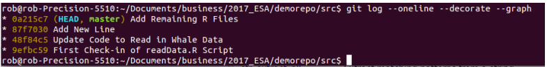
```

So what all have we asked for? We’ve said, show us the log, but in a compact form, decorate it to have it
show where the current branch (master/main) is pointing (HEAD), and show us the graph. Recall that git is a
directed graph, where snapshots (commits) are the nodes. On the graph above we have 4 nodes, with the
master/main branch pointing to the latest commit. We can move this pointer, but that’s a topic we’ll take up later.
If we want to really get a good sense of what things look like at the different nodes, use the git show
command (Figure 4).

```{}
git show
```


```{r, echo=FALSE,out.width='100%', fig.align='center', fig.cap='Figure 4', include=TRUE, results="hold"}
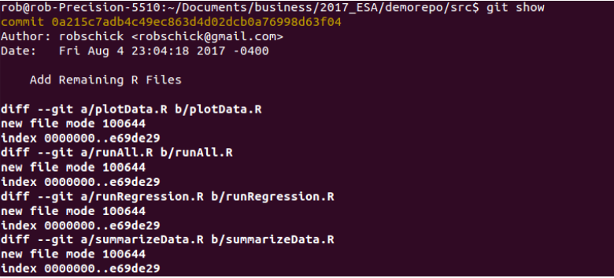
```

And then one specific node:

```{}
git show 87f7030
```


Once we’ve asked for a specific node, we get a lot of useful information about the commit, including who did
it, when they did it, what the message was, and what the commit contained (Figure 5).

```{r, echo=FALSE,out.width='100%', fig.align='center', fig.cap='Figure 5', include=TRUE, results="hold"}
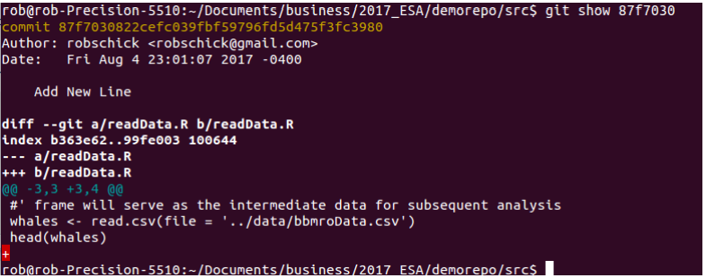
```

## Commit Messages

Recall what we talked about in Lecture - good commit messages are worth the effort, and will help you come
back to the repo/project and understand not only what you did (use the diffs for that), but also why. If
you are writing command line commit messages, it’s hard to really write a thoughtful one. However, if you
have an editor configured (my default is vi) then you can easily write a good one. Try it (with the knowledge
that this commit is really a toy commit).You can invoke the editor by just typing git commit without any
flag. Here’s what I get when I type that (Figure 6):

```{r, echo=FALSE,out.width='100%', fig.align='center', fig.cap='Figure 6', include=TRUE, results="hold"}
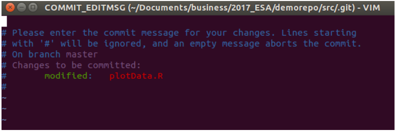
```

Now you can type a good message with a less than 50 character Capitalized First Line, followed by detailed
text that describes the why of the commit. With a declarative succinct first line, you can see at a glance
what each commit is about, and then with git show you can dig in and read more.

On the subject of declarative, here’s a useful tip. You want the first line to complete this sentence = ‘If
added, this commit will . . . .’

Here’s what I get - note the top part of the figure that shows the oneline with the declarative statement. . . “If
added, this commit will Add a Draft Histogram of the Sea Surface Temperature Data.” (Figure 7)

```{r, echo=FALSE,out.width='100%', fig.align='center', fig.cap='Figure 7', include=TRUE, results="hold"}
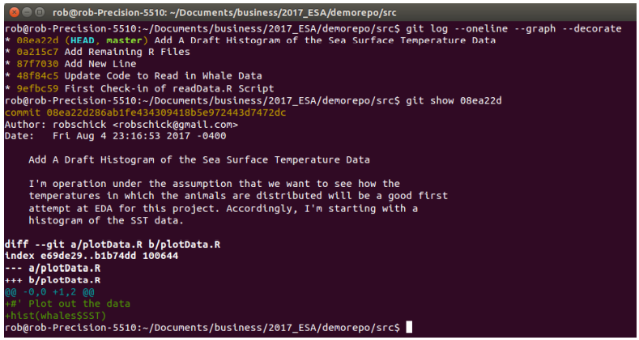
```

## Git Diff

How can we easily see what changed between two commits? We may see that one line indicated a big change
that we want to inspect. Use the diff command on any two nodes in the graph:

```{}
git diff 9efbc59 48f84c5
```

Note that the order matters. The code above says show me what changed as the repo moved from 9efbc59
to 48f84c5 Here’s what mine looked like (Figure 8):

```{r, echo=FALSE,out.width='100%', fig.align='center', fig.cap='Figure 8', include=TRUE, results="hold"}
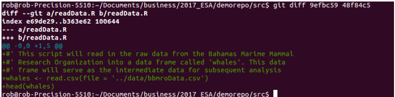
```


## File Management with Git - rm and mv

One thing that is good to remember is that you’ve added a file to git, then it’s being tracked until you delete
it. And actually even if you delete it, it gets stored in previous commits - because it was in that repo at one
point in time. Though the file is just a file, once it’s tracked, don’t be tempted to remove it via the operating
system.

If you want to delete a file, or if you want to change it’s name, git offers utilities to do this. Not surprisingly, they are git rm and git mv (if you make the analogy with command line interface commands). 

Let’s see them in operation. 

First we’ll add two files - one to move/rename
and one to delete. We’ll do this in the src directory again.

```{}
touch prediction.R
touch simData.R
git add .
git commit -m "Add Two Files for Experimenting with Moving and Deleting"
```

With these setup and added, let’s delete it at the command line just to see what happens:

```{}
rm prediction.R
```

All looks good right from the OS point of view - right? What happens when you ask git what the status is?

```{}
git status
```

What to do now? We back out the change


```{}
git checkout -- prediction.R
git status
```


Now we’re back to a clean working directory. So we can delete with git. Note that when you do this, and
look at the status, it looks very different - the first one makes a change (the deletion) that hasn’t been staged,
where as the second (git rm) makes a change that has been committed and is ready to stage (Figure 9):

```{r, echo=FALSE,out.width='100%', fig.align='center', fig.cap='Figure 9', include=TRUE, results="hold"}
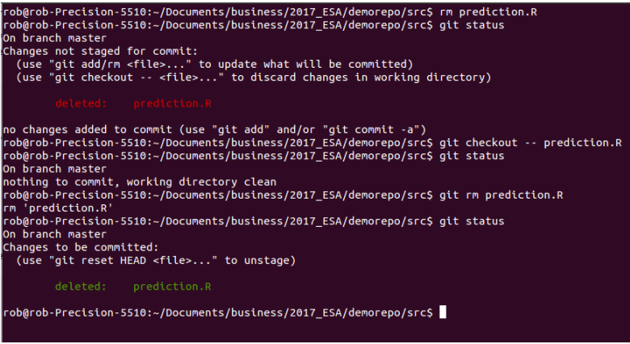
```


Basically to get a clean working directory if you go the rm route, you have to add the file to the staging area,
only to then commit it. git rm just does that for you in one step.

Now is a good time to commit the deletion.

```{}
git commit -m "Delete prediction.R File"
```

Now that file is gone and the repo is clean, let’s rename the other file - this time using git. As above, if you
use git’s utilities for this, you don’t have to add the changes

```{}
git mv simData.R simXYData.R
git commit -m "Rename Simulation Script for Clarity"
```

## The .gitignore File


One person in the responses to the survey asked about what to version control and what not to. I tend to keep just the code versioned, and things that can be easily created on the fly, I ignore. If you create a lot of these files, e.g. intermediate *.Rdata files, or *.png files, etc., your repo can get pretty messy as you create them. Even if you aren’t tracking them, git is aware of them, so typing git status can yield a lot of information.

Thankfully, there’s mechanism, and it’s called the .gitignore file. All you have to do is create it, put in a
few patterns to match (and thus have git ignore), and then place it into version control. Let’s try it with a
pdf file. 

First add the plotting device code to your plotData.R script.

```{}
pdf(file = '../results/firstHistogram.pdf')
hist(whales$SST)
dev.off()
```

Add and commit these changes, and then let’s run the code from the command line (Figure 10).

```{r, echo=FALSE,out.width='100%', fig.align='center', fig.cap='Figure 10', include=TRUE, results="hold"}
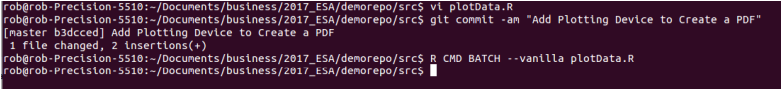
```

What do you think we’ll have now? How many new files? Where and what will they be?

If you answered 2 files - gold star for you. There’s the .pdf file in the results directory, but there’s also the
.Rout file in the src directory. But if you type git status what do you think you’ll see?

Probably not what you expected to see, at least it wasn’t what I thought we’d see (Figure 11).

```{r, echo=FALSE,out.width='100%', fig.align='center', fig.cap='Figure 11', include=TRUE, results="hold"}
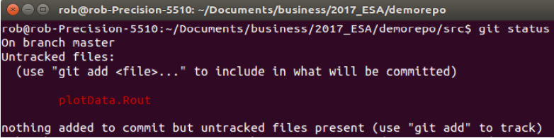
```


But here’s a good thing to be aware of. We only have the repo initialized in src, and not in results. At any
rate, there’s a chance we might create the odd pdf file here in addition to the .Rout files, so let’s exclude
them both. We do this with the .gitignore file, which we have to make, and which, we have to place under
version control.
To do this, make a new text file, and add these two lines:

```{}
*.Rout
*.pdf
```

Save it as .gitignore, then add it, and then commit it.

Now let’s rerun the R script that will make the .Rout file and we’ll see what happens. Before you type git
status what do you think you’ll see?

If all goes well you’ll not see anything - git will indicate that you have a clean working directory.

#  Git in RStudio & Time Travel

The learning objectives here are 1) to work through the code/add/commit cycle in RStudio, and 2) to get a
feel for how you can move around the repository. This is pretty mind-bendy to me at times, but if you go
back to the core idea of git storing a series of snapshots as nodes along a graph, you’ll be able to wrap your
head around the idea of revisiting any of those nodes at any time.

## RStudio

RStudio provides a very nice front-end IDE for R. As it continues to develop, more and more capabilities are
added. Version control with svn or git has been available for quite some time. You may have even seen the
git tab in RStudio and wondered what it was doing there. I use both the command line and RStudio for my
git work, so it’s a good idea to have a feel for both. I prefer the command line interface for some things, but
being a visual person, RStudio’s git support has a lot to offer. IN particular, it’s quite easy to write a good
commit message, and to visually see the diffs/changes that you are making.

You will have seen how we did this in the Lecture - now it’s your turn. Make some changes to a file, add
and commit them. Also, add a new script, and note the difference in the buttons in the git tab in RStudio -
i.e. when do you see an A in the button vs. an M? What are the command line analogs?

## Git Diff

How can we easily see what changed between two commits? We may see that one line indicated a big change
that we want to inspect. Use the diff command on any two nodes in the graph:

```{}
git diff 9efbc59 48f84c5
```

Note that the order matters. The code above says show me what changed as the repo moved from 9efbc59
to 48f84c5 Here’s what mine looked like (Please note the the Sha-1s wont be the same in your repo) (Figure 12):

```{r, echo=FALSE,out.width='100%', fig.align='center', fig.cap='Figure 12', include=TRUE, results="hold"}
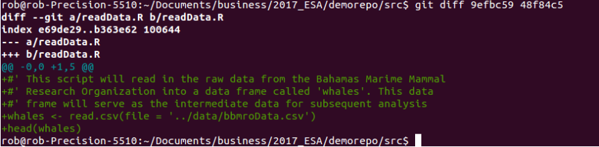
```

When you think about working with your future self - let alone any additional collaborators - these diffs are
powerful ways to see what actually changed. Couple the diffs with a good commit message, and you can quickly get oriented into how and why things change over time.

Compare this to a script that you just rename, or keep saving as you alter it. You may get to a point with
that script, where it’s broken and it’s hard to go back to its state when it last worked. Or you may recall having ventured down a pathway that you gave up on, only now you want to get back to that path to try that experiment again. With git this is straightforward. Without git it’s just about impossible.

One thing you can get in the habit of doing (if it works for you) is to look at the diffs before you commit. My
typical workflow is something like:

1. write some code

2. Add it

3. Commit it

4. write some more code, etc.

Before you add and commit the changes, though, you can just type git diff to see what has been changed.
With the code we’ve been running here, it’s just toy syntax, but if you were working on a complicated
function, it’s often nice to see what you’ve done.
Going to a Particular Snapshot

Now that we have a few commits built up, we can go back to a particular commit and have our code (in the
same file!) look exactly as it did at that commit. And we can do this without throwing away the most recent
work. Take a look at your history with git log --oneline and chose a commit you want to navigate to (Figure 13).

```{r, echo=FALSE,out.width='100%', fig.align='center', fig.cap='Figure 13', include=TRUE, results="hold"}
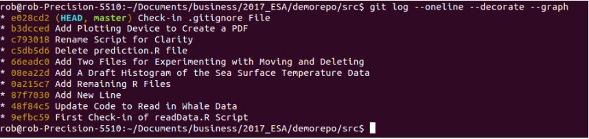
```

Yours will be different from mine, but to go to that node, we use the checkout command:
```
#Please change 0a215c7 to any of your Sha-1 
git checkout 0a215c7
```

You’ll see the detached HEAD warning, and if you type 
git ls-files you’ll see the files git was tracking at
that point in time. If you look at the plot script, you’ll see it at that state (Figure 14):

```{r, echo=FALSE,out.width='100%', fig.align='center', fig.cap='Figure 14', include=TRUE, results="hold"}
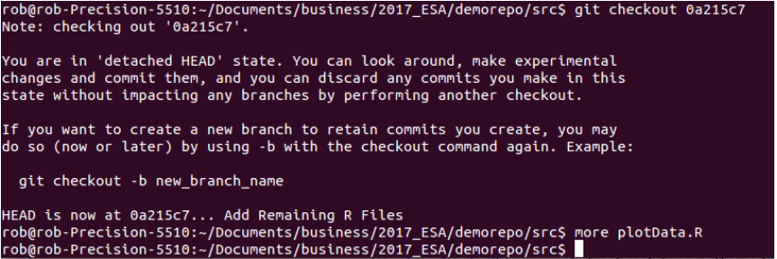
```

In my case the plot script.

Two thoughts here:

  1. If we wanted to recreate old figures. This is one way we could do it. Checkout an old repo, and re-issue
the R code from the command line to make the file. You can also hang on to them as we mentioned in
lecture via the storing of old copies of the results/Figures folder with an archival date. Just make
sure you are consistent if you follow this, otherwise you may end up with an old file that has a current
name, but not the current content, etc.

  2. Type git log --oneline --decorate here to see what you get. You’ll probably see a shortened
history, because we’ve moved the pointer back to this particular commit, and commits know their
parent commit - so the later ones aren’t listed. This may give you great pause because you don’t see
work you’ve already done. There’s yet another command to help you (Figure 15).

```{}
git reflog
```


```{r, echo=FALSE,out.width='100%', fig.align='center', fig.cap='Figure 15', include=TRUE, results="hold"}
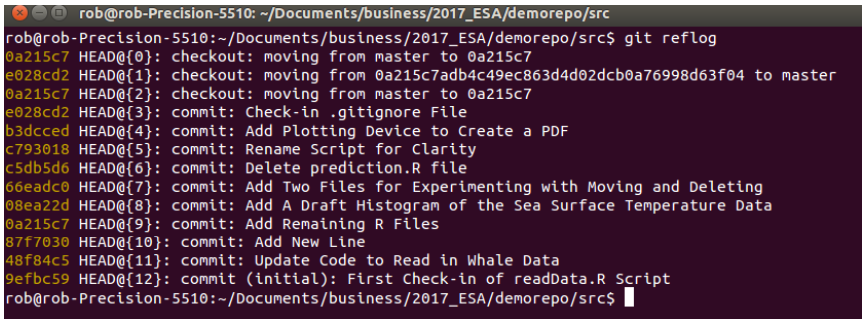
```

This command basically stores every command you issue in git. So you can see that now we’re checked out on the 0a215c7 node (your number is not as same as this), and even though we don’t see all the other downstream commits when we type git log we can rest assured that they commits are all still there.

This can be really useful as you progress and get into more complicated things with merging branches and
rebasing the repository. The take home is that git tries really really hard not to lose your data.

To get back to the last commit (Figure 16):

```{}
git checkout main
```

```{r, echo=FALSE,out.width='100%', fig.align='center', fig.cap='Figure 16', include=TRUE, results="hold"}
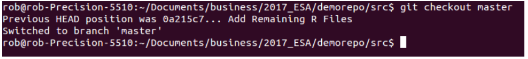
```

# Connecting local and github

We’re almost done! Phew. We’ve covered a lot of ground, but there’s still another important lesson, and that
is embracing what some people call the 4th state of git - the remote repository. There are many ways to do
this, and sometimes they all seem sort of similar but different in frustrating ways, i.e. you might think you
are following a work-flow that worked for you only to run into some weird unexplained git error.

Important note here - git is huge and can be frustrating - but since it’s huge and since it was developed by
an unber-nerdy crowd, there are a huge amount of resources out there. My first thing to do if I see an error I
don’t understand, is to type it into google, and start browsing the answers on [StackOverflow](). At current
count, there are 88,555 questions tagged with git on stack overflow. Chances are, the answer is out there!
At any rate, one workflow to connect a local repo to GitHub is as follows (n.b. this is done at the start):

1. on github, add a new repository. I typically add a R themed .gitignore file, and a README

2. copy its url (http or ssh - I prefer ssh) to clone it

3. Navigate to the parent folder, clone the repo

4. At this point you can either cd into the repo and start work, or if you want to work in RStudio, simply
start a new project with the “Existing Directory” option chose the repo and the git tab will appear.
You can also bypass the cloning from the command line be choosing the option to clone from a repo, but
make sure all your ssh keys/ducks are in a row.
Now when you look at the git tab in RStudio, you will see one important difference from before - the
Push/Pull tabs are live, i.e. they are not greyed out.
However, what if you already have a local repo that is not connected to GitHub? Sort of like we have here.
First type this:

```{}
git remote -v
```

You should see nothing! How do we connect to github then? 

Follow these steps:

1. Go to github and make a new empty repo using the same name as the one on your computer (you can
use different names, but let’s keep it simple for now).


2. Copy the url of the repo - using the ssh option

3. Add the remote locally

4. Verify the connections

5. Push the changes.
Let’s see that:

Once you click on Create Repository, GitHub gives you this really helpful page (Figure 17-18):

```{r, echo=FALSE,out.width='100%', fig.align='center', fig.cap='Figure 17', include=TRUE, results="hold"}
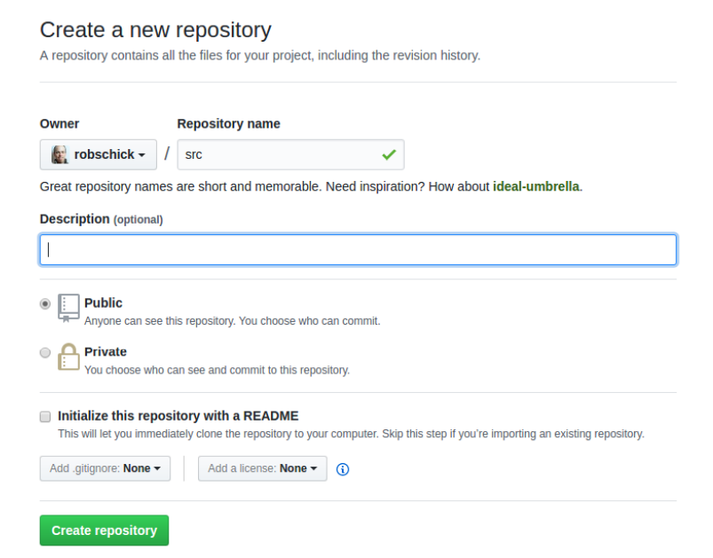
```

```{r, echo=FALSE,out.width='100%', fig.align='center', fig.cap='Figure 18', include=TRUE, results="hold"}
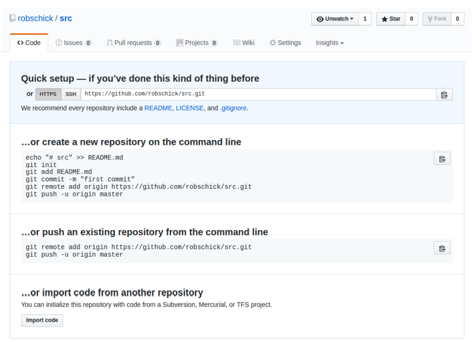
```


In our case, we’re going to push the existing repo from the command line (note that of course your url will
be different):

```{}
git remote add origin https://github.com/robschick/src.git
```

[Note that I already showed you how to do with SSH url.]

Once we’ve added it, let’s look again to see if we are talking to github:

```{}
git remote -v
```

I see this now (Figure 19):

```{r, echo=FALSE,out.width='100%', fig.align='center', fig.cap='Figure 19', include=TRUE, results="hold"}
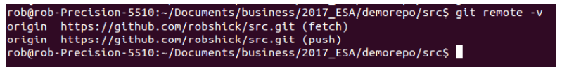
```

With it added, then let’s push our changes

```{}
git push -u origin master
```

Wait, why did it fail?
I know I used the right password, but it’s failing. Well, you’ll note in my enumerated list that I said I prefer
using SSH - this is why. If I look at my config file I’ll see that in the remote.origin.url it’s using https, but I
want ssh:
I change it to ssh at the command line (That is why i taught you SSH method) (Figure 20-21):


```{r, echo=FALSE,out.width='100%', fig.align='center', fig.cap='Figure 20', include=TRUE, results="hold"}
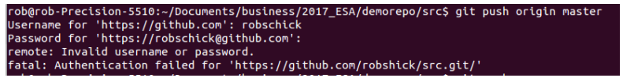
```


```{r, echo=FALSE,out.width='100%', fig.align='center', fig.cap='Figure 21', include=TRUE, results="hold"}
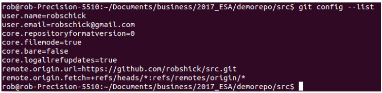
```

```{}
git remote set-url origin git@github.com:robschick/src.git
```

You can verify that it is right with

```{}
git remote -v
```

And then happiness ensues (Figure 22):


```{r, echo=FALSE,out.width='100%', fig.align='center', fig.cap='Figure 22', include=TRUE, results="hold"}
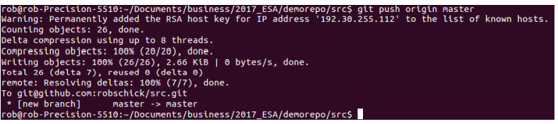
```


And finally we can see them on GitHub to make sure all is right.

## Pushing Local Changes

So now we’ve pushed up all of the changes we have made to date locally, so they are mirrored on GitHub.
One of the biggest advantages of using git, or any distributed version control system, is that you now have
multiple points of failure, instead of just one, i.e. you’ve increased your bus factor and this is always a good
thing.

When we work with a remote repo, we now add an extra stage to our local git workflow. From time to time,
we need to push our local changes to the local repository. How often you do this is a matter of personal
preference. I tend to do it a lot, especially since my code is typically only being used by me. For someone like
Hadley Wickham who is writing a lot of influential R code, his feeling is that pushing is essentially publishing.
So each time you push, it’d better work! (Figure 23)

```{r, echo=FALSE,out.width='100%', fig.align='center', fig.cap='Figure 23', include=TRUE, results="hold"}
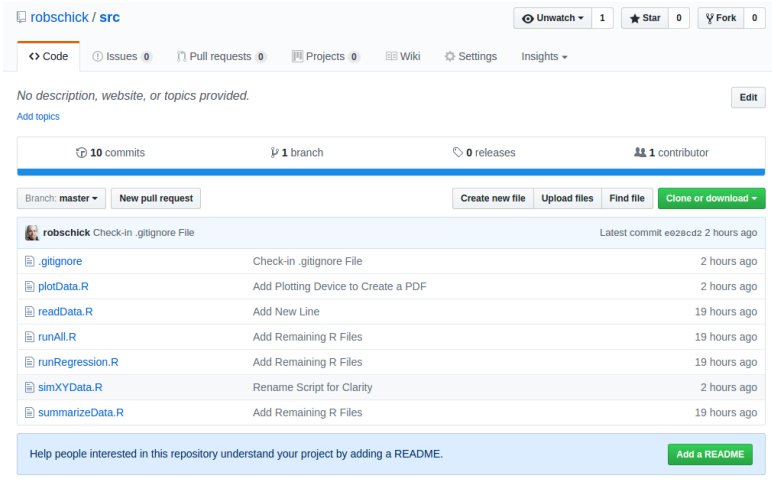
```


Go ahead and repeat the cycle - either in RStudio, or the command line. Add some code, add some files, commit them, and push them. Then go and view them on GitHub.

## Pulling Changes

One best practice is issue git pull before you push. This just ensures that you have the most up to date code before you push. The benefits of this will become apparent in the next section

## Merge Conflict

Ah the dreaded merge conflict. These can be a pain in the butt when you first encounter them, but all in all,
they are pretty straightforward. As you get more advanced with git, you can configure a graphical merge tool if you want to help with this. They can be great, but for now, we’ll just handle this on the command line.

What is a merge conflict? It’s essentially what happens when the repository gets out of sync. Let’s say you
make a change on your local computer, and push it to github, but then you working on a node, and you make a change there - but you haven’t yet brought down the most up to date changes from GitHub. When you go to push your changes up to the node, you will get rejected, and then you have to manually resolve the conflict.

We don’t have a node here, but we can mimic it well enough with a local repo and GitHub:

1. In your repo, make a change to a file, add it, and commit it, but don’t push it to GitHub;

2. Then, navigate to github, and make a change to the same file. Use the pencil icon to edit it directly;

3. Add a commit message, and commit the change;

4. Navigate back to the command line and issue the git push command;

5. If you are lucky, all hell will break loose. 

Here’s what I have on GitHub (Figure 24).

```{r, echo=FALSE,out.width='100%', fig.align='center', fig.cap='Figure 24', include=TRUE, results="hold"}
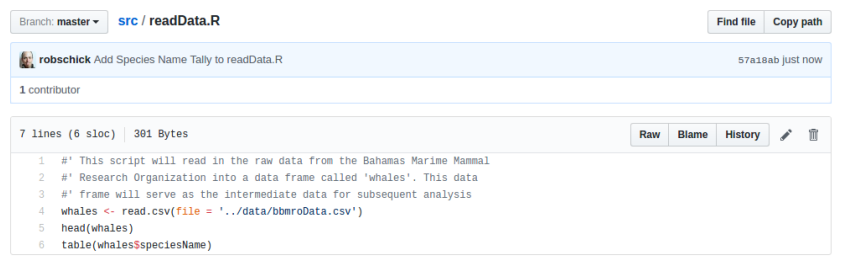
```


And what I have locally (25):

```{r, echo=FALSE,out.width='100%', fig.align='center', fig.cap='Figure 25', include=TRUE, results="hold"}
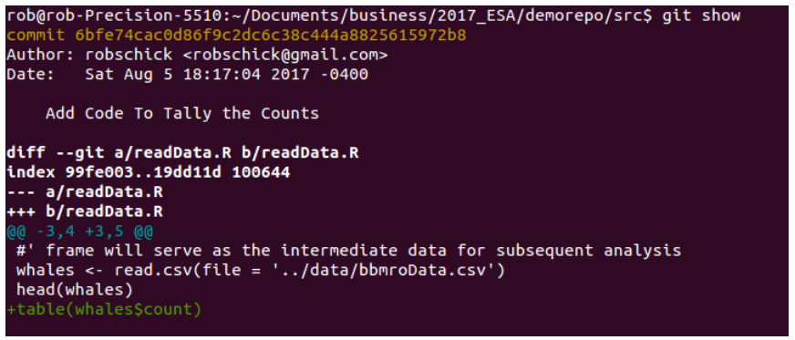
```

Ok, let’s give it a whirl:

```{}
git push origin master
```

Sad times, but we can fix the problem. First, let’s pull.


```{}
git pull origin master
```

And here we see the conflict (Figure 26-27):

```{r, echo=FALSE,out.width='100%', fig.align='center', fig.cap='Figure 26', include=TRUE, results="hold"}
knitr::include_graphics('exo_workflow25.png')
```

```{r, echo=FALSE,out.width='100%', fig.align='center', fig.cap='Figure 27', include=TRUE, results="hold"}
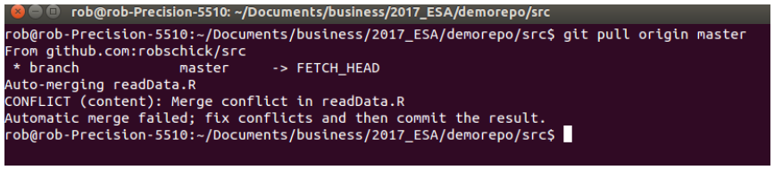
```

Now we have to fix them manually, which we do in a text editor (Figure 28):

```{r, echo=FALSE,out.width='100%', fig.align='center', fig.cap='Figure 28', include=TRUE, results="hold"}
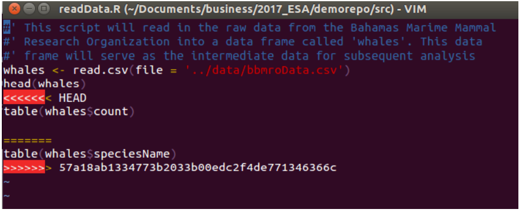
```


Once it’s resolved, then we go through the regular cycle again:

```{}
rob@rob-Precision-5510:~/Documents/business/2017_ESA/demorepo/src$ vi readData.R
rob@rob-Precision-5510:~/Documents/business/2017_ESA/demorepo/src$ git add readData.R
rob@rob-Precision-5510:~/Documents/business/2017_ESA/demorepo/src$ git commit -m "Resolve Merge Conflict with GitHub Code"
[master 2cf2829] Resolve Merge Conflict with GitHub Code
rob@rob-Precision-5510:~/Documents/business/2017_ESA/demorepo/src$ git push origin master
```

Very happy to let you know that this is the end.