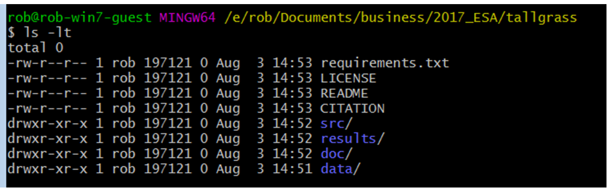

class: center
# Acknowledgements
The content of this module are based on materials from:

.pull-right[

]
.pull-right[
[Rob Schick's materials](https://nicholas.duke.edu/people/staff/schick-phd)
]
---
class: center
# Brainstorm with class
.left[
* What are critical elements needed?

* What has been a problem?

* What do you consider a need?
]
---
class: center
# Consistent Themes
.left[
- Working with collaborators

- Consistent uncluttered file structure

- Ability to re-enter the project and quickly reorient

- Knowing what to version control

- Knowing version control

- Testing new code without breaking original

- Re-running things efficiently
]
---
class: center

# What is a ***project***
.left[
A project is a well organized folder or directory.

A project must contain all data related to it. Thus, we must have:

- all data the project is based upon;

- all the code (for cleaning and carrying out data analysis);

- all necessary text that explains how the code talks to the data to render results;

- any final reports derived from the project management;

- any license entailed to the project;

- a clear record of how the project has evolved through time (like lab notes, measurement protocol etc.)
]

---

class: center
# A good Enough starting point
.left[

“Computing workflows need to follow the same practices as lab projects and notebooks, with organized data, documented steps, and the project structured for reproducibility, but researchers new to computing often don’t know where to start.”
---[Wilson et al. (2017)](https://journals.plos.org/ploscompbiol/article?id=10.1371/journal.pcbi.1005510)

]


---
class:center
# Six core tenets of a good enough practice

```{r, echo=FALSE,out.width='100%', fig.align='center', fig.cap='', include=TRUE}

```

---
class: center
# Six core tenets of a good enough practice 2

```{r, echo=FALSE,out.width='100%', fig.align='center', fig.cap='', include=TRUE}

```

---
class: center
# Six core tenets of a good enough practice 3
```{r, echo=FALSE,out.width='100%', fig.align='center', fig.cap='', include=TRUE}

```

---
class: center
# Six core tenets of a good enough practice 4
```{r, echo=FALSE,out.width='100%', fig.align='center', fig.cap='', include=TRUE}

```

---
class: center
# Six core tenets of a good enough practice 5

```{r, echo=FALSE,out.width='100%', fig.align='center', fig.cap='', include=TRUE}

```

---
class: center

# Six core tenets of a good enough practice 6
 
```{r, echo=FALSE,out.width='100%', fig.align='center', fig.cap='', include=TRUE}

```

---
# Six core tenets of a good enough practice 7
 
```{r, echo=FALSE,out.width='100%', fig.align='center', fig.cap='', include=TRUE}

```


.center[
[See magnificent tips from](https://simplystatistics.org/2016/04/21/writing/) from [Jeff leek](https://jtleek.com/)
]
---
# Six core tenets of a good enough practice 8
 
```{r, echo=FALSE,out.width='100%', fig.align='center', fig.cap='', include=TRUE}

```

---
# Six core tenets of a good enough practice 9

.left[

Below is graphically how the structure of a good enough project should look like]

```{r, echo=FALSE,out.width='120%', fig.align='center', fig.cap='Drawing by Stella Schick', include=TRUE}

```


---
class: center
# Let’s Build and Populate a Project

.left[
* Navigate to a directory

* Make a folder for your project named whatever you want

* cd into the project folder 

* Start making folders with mkdir

* Create 4 files using a text editor, or the touch command

    - CITATION;
  
    - README;
  
    - LICENSE;
  
    - requirements.txt
]

---
class: center
# Have you succeeded? 
Here is how it should look like on your git bash. Does yours look similar? 

```{r, echo=FALSE,out.width='100%', fig.align='center', fig.cap='', include=TRUE}

```


---
class: center
# What goes in each part? – Data Folder

.left[
* Raw data

  - Consider locking the file, or making read-only

  - Never hand edit the file!

* Metadata

  - I have one .csv file from BMMRO
]

---
class: center
# What goes in each part? – src Folder
.left[
* Two types of scripts
 
  - Individual analytical blocks 
 
      + reshapeData.R
 
      + runRegression.R

* Controller file, e.g. runAll.R 

* runAll.R may contain:
  - source(reshapeData.R)
  - source(runRegression.R)
  - source(plotAnalysis.R)

And can be called from a command prompt with: 
R CMD BATCH –vanilla runAll.R runAll.rout &
]

---
class: center

# What goes in each part? – results Folder

.left[
* Any “generated” result:
  
  - Intermediate results
     
      + Cleaned data
      
      + Simulated data
  
  - Final Results
  
      + Figures
  
      + Tables

* For most projects, you’ll likely have sub-directories:

* Results

  - CleanedData

  - Figures

  - Tables
]

---
class: center

# What goes in each part? - doc Folder

.left[

* Any text based documents:

* If manually versioning, a changelog.txt file

* projectNotebook.md (maybe Notepad or evernote…)

* Manuscript (if using a version control, otherwise Google Docs)
]


---
class: center

# What goes in each file?  
.left[
- The README: file provides an overview of the project as a whole

  * Project’s title

  * Brief description

  * Up-to-date contact information

  * An example of how to run the code

  * How people can engage with the project
    
  * If you are looking for contributors

- CITATION: Explains how to reference the project:
  
  * DOIs for code and data
  
  * DOI for project if using OSF
  
  * Manuscript [Example here](https://github.com/dib-lab/khmer/blob/master/CITATION)

- LICENSE
Explains the licensing, e.g. CC-BY, CC-ND, etc.


]
---
# Get a copy of a good enough practice
You can get a template of a good enough Project structure as repository from [Rob Schick Github](https://github.com/robschick/goodEnough) 
```{r, echo=FALSE,out.width='100%', fig.align='center', fig.cap='', include=TRUE}

```

---
# Good enough project workflow practice
[Bahamas Marine Mammal Research Organization (BMMRO) data](https://ecologicaldata.org/wiki/bahamas-marine-mammal-research-organization)
```{r, echo=FALSE,out.width='100%', fig.align='center', fig.cap='', include=TRUE}

```

---
class: center, middle

# Thank you for listening!
Any questions now or email me at [**dossa@xtbg.org.cn**](http://people.ucas.edu.cn/~Dossa?language=en)

Slides created via the R package [**xaringan**](https://github.com/yihui/xaringan).

The chakra comes from [remark.js](https://remarkjs.com), [**knitr**](https://yihui.org/knitr/), and [R Markdown](https://rmarkdown.rstudio.com).
