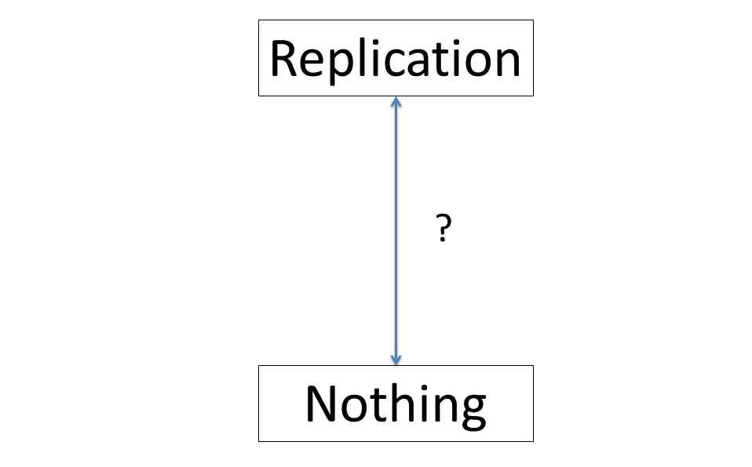
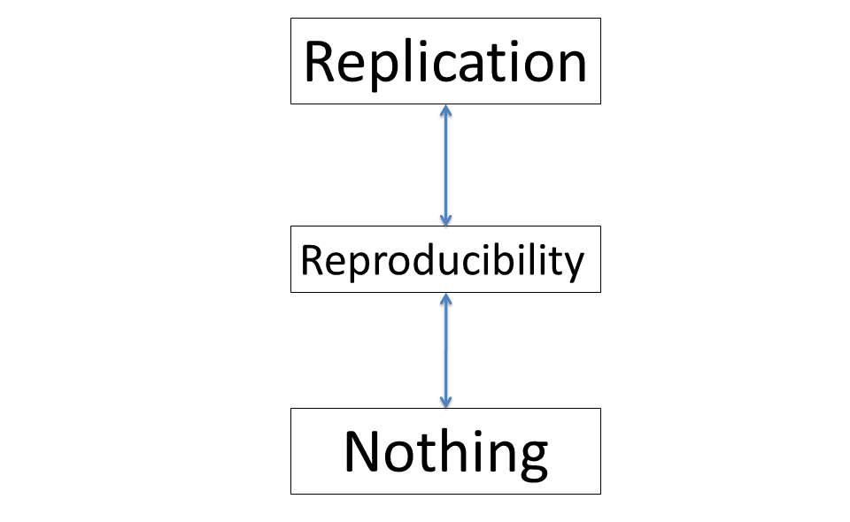
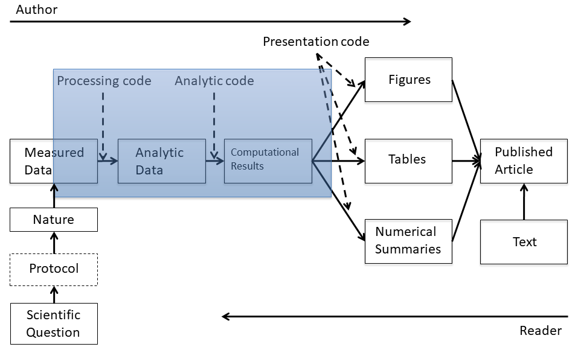
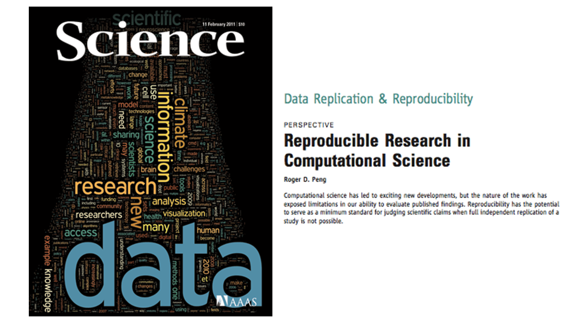
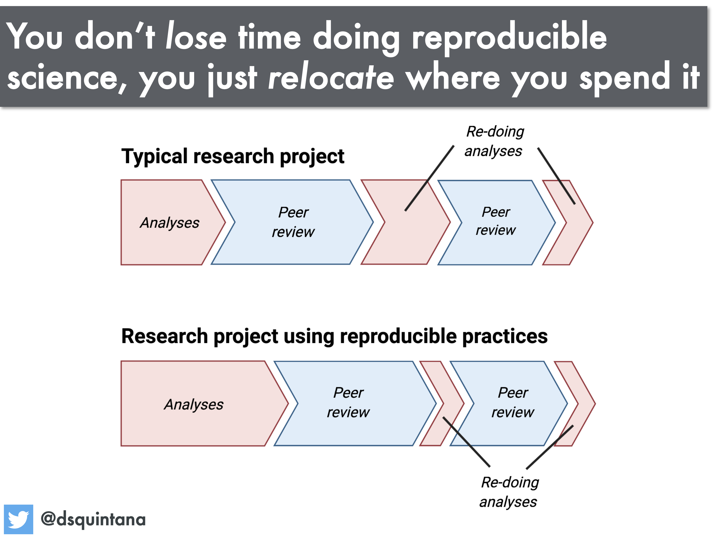

class: center, middle
# Acknowledgements
The content of this module are based on materials from:

.pull-right[

]
.pull-right[
[Roger D. Peng's materials](https://publichealth.jhu.edu/faculty/1549/roger-d-peng)
]

---
class: center, middle
# Where is the Gap?

---
class: center
# How can we bridge the gap?


---
class: center
# Research pipeline 

Please examine again this pipeline.
---

class: center

# Recent developments in reproducible research

---
class: center

# What do we need for reproducible research?

--
.left[
- Analytic data are available;
]
--
.left[
- Analytic code are available;
]
--
.left[
- Documentation of code and data;
]
--
.left[
- Standard means of distribution.
]

---
class: center

# Who are the players?
.left[
- Authors:

    -> Want to make their research reproducible

    -> Want tools for RR to make their lives easier (or at least not much harder)
]

--
.left[
- Readers:

    -> Want to reproduce (and perhaps expand upon) interesting findings

    -> Want tools for RR to make their lives easier
]
---
class: center

# Existing chalenges
.left[
- Authors must undertake considerable effort to put data/results on the web (may not have resources like a web server);


- Readers must download data/results individually and piece together which data go with which code sections, etc.;


- Readers may not have the same resources as authors;


- Few tools to help authors/readers (although toolbox is growing!).
]
---
class: center

# Responses to challenges: in reality

.left[
- Authors

      -> Just put stuff on the web

      -> (Infamous) Journal supplementary materials

      -> There are some central databases for various fields (e.g. biology, ICPSR)
]

--


.left[
- Readers

      -> Just download the data and (try to) figure it out

      -> Piece together the software and run it
]


---
class: center

# Literate (statistical) programming

.left[

- An article is a stream of text and code;

- Analysis code is divided into text and code chunks;

- Each code chunk loads data and computes results.
]
--

.left[

- Presentation code formats results (tables, figures, etc.);

- Article text explains what is going on;

- Literate programs can be weaved to produce human-readable documents and tangled to produce machine-readable documents.

]
---
class: center

# Literate (statistical) programming 2

.left[
Literate programming is a general concept that requires:

- A documentation language (human readable);

- A programming language (machine readable):
    1. Sweave uses L<sup>A</sup>T<sup>E</sup>X and R as the documentation and programming languages

    2. Sweave was developed by Friedrich Leisch (member of the R Core) and is maintained by R core

[Sweave's main web site](http://www.statistik.lmu.de/~leisch/Sweave).
]

---
class: center

# Sweave Limitations

.left[
Sweave has many limitations:


- Focused primarily on LaTeX language, a difficult to learn markup language used only by weirdos;

- Lacks features like caching, multiple plots per chunk, mixing programming languages and many other technical items;

- Not frequently updated or very actively developed.
]

--

.left[So is there any alternative to Sweave?
] 

---
class: center
# Alternative to Sweave: knitr

.left[
- Yes, there is knitr is an alternative (more recent) package to Sweave developed by [**Yihui Xie**](https://yihui.org/en/about/);

- Brings together many features added on to Sweave to address limitations;

- knitr uses R as the programming language and variety of documentation languages LaTeX, Markdown, HTML;

- knitr was developed by Yihui Xie (while a graduate student in statistics at Iowa State);

- See [*knitr*](http://yihui.name/knitr/) for more and in lectures later.	
]

---
class: center
# Does reproducibility consume more time?
```{r, echo=FALSE,out.width='80%', fig.align='center', fig.cap='Reproducibilit equals effecient use of time', include=TRUE, results="hold"}

```

---
class: center
# Summary

.left[
- Reproducible research is important as a minimum standard, particularly for studies that are difficult to replicate;

- Infrastructure is needed for creating and distributing reproducible documents, beyond what is currently available;

- There is a growing number of tools for creating reproducible documents.

]

---

class: center, middle

# Thank you for listening!
Any questions now or email me at [**dossa@xtbg.org.cn**](http://people.ucas.edu.cn/~Dossa?language=en)

Slides created via the R package [**xaringan**](https://github.com/yihui/xaringan).

The chakra comes from [remark.js](https://remarkjs.com), [**knitr**](https://yihui.org/knitr/), and [R Markdown](https://rmarkdown.rstudio.com).
