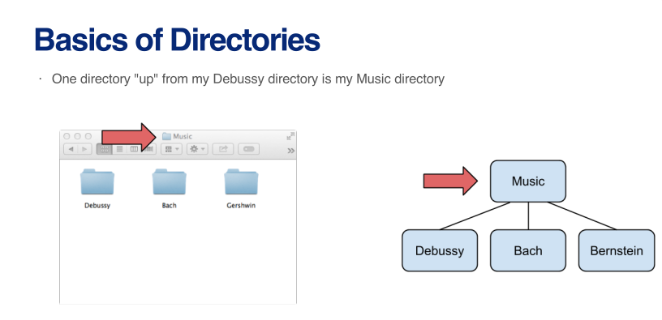
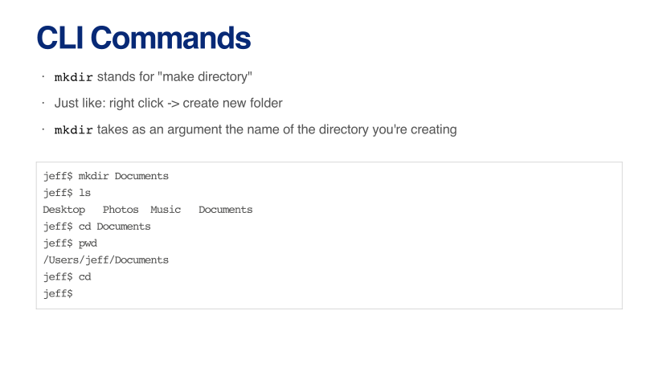

name: part1
class: inverse, center, middle

# Part 1. Using Version Control

<style type="text/css">

.hljs-github .hljs {
    background: #e5e5e5;
}

.inline-c, remark-inline-code {
   background: #e5e5e5;
   border-radius: 3px;
   padding: 4px;
   font-family: 'Source Code Pro', 'Lucida Console', Monaco, monospace;
}


.yellow-h{
   background: #ffff88;
}


.out-t, remark-inline-code {
   background: #9fff9f;
   border-radius: 3px;
   padding: 4px;
   
}

.pull-left-c {
    float: left;
    width: 58%;
    
}

.pull-right-c {
    float: right;
    width: 38%;
    
}

.medium {
    font-size: 75%
    
}

.small {
    font-size: 50%
    }

.action {
    background-color: #f2eecb;
  
}


</style>

---
## Version Control

- Research papers have many versions before publication

    - typically written over a long period of time, in numerous sittings
    - at the end of every sitting, essentially a different version of the same manuscript is created<sup>*</sup>


---
## Version Control

- Research papers have many versions before publication

    - typically written over a long period of time, in numerous sittings
    - at the end of every sitting, essentially a different version of the same manuscript is created
    

- With many versions created over time, there emerge at least two challenges

   - keeping track of changes and versions
   - reverting to a previous version when necessary

--

- We all version control, in different ways, such as

   - edit, rename, save
   - use applications or websites such as Dropbox, Google Docs, Overleaf
   - use distributed version control systems such as Git and GitHub

---
## Version Control &mdash; Manual Attempts

Typically, hand-made attemps to version control lead to cluttered folders

```{r eval=FALSE}
manuscript
   |
   |- journals_FINAL_19May.Rmd
   |- journals_FINAL.Rmd
   |- journals_26APRIL_newliterature.Rmd
   
   ...
   
   |- journals.Rproj
   |- references.bib  
   |- apa_7th.csl
   
```

---
## Version Control &mdash; Git and GitHub &mdash; Definitions

- Git
    - a software that keeps track of versions of a set of files
    - it is *local* to you, the records are kept on your computer

--

- GitHub
    - a hosting service, or a website, that can keep the records
    - it is *remote* to you, like the Dropbox website
    - but unlike Dropbox, GitHub is specifically structured to keep records with Git

--

- Repository, or repo
    - a set of files whose records are kept together, by Git and/or on GitHub
    - it is like a folder, which can keep files and other folders containing files

---
## Version Control &mdash; Git and GitHub &mdash; Definitions

- To commit
    - to take a snaphot of, or to version, a repository
    - it is like saving a new version of all files and sub-folders in your project folder with a new name
    - it is local, the records are kept on your computer unless you `push`

--

- To push
    - to move the records from Git to GitHub, from your computer to online server
    - it is like uploading (the new versions of) your files and sub-folders to a website, 
    - it also involves merging, if this not the first push

.footnote[

<sup>*</sup> For projects that are single-authored on a single computer, merging is typically automatic. It becomes an issue for collaborated projects, which we will cover in the next section &mdash; Part 9.

]

---
## Version Control &mdash; Git and GitHub

Version control with Git and GitHub requires

1. .yellow-h[initial setup], done once<sup>*</sup>
    - unless for a new computer or, if ever, a new GitHub account
    - a bit technical, but worth the hassle
    
2. .yellow-h[project setup], repeated for every paper
    - shorter, less complicated

.footnote[

<sup>*</sup> We have started this process already, in Part 1 of the workshop, by downloading and installing Git and signing up for GitHub. [Back to the relevant slide](#install-git).

]

---
name: part2
class: inverse, center, middle

# Part 2. Getting the Tools Ready

---
class: action
name: install-git

## Git &mdash; Download from the Internet and Install

- For Windows, install 'Git for Windows', downloading from [https://gitforwindows.org](https://gitforwindows.org/)
       - select 'Git from the command line and also from 3rd-party software'
       
- For Mac, install 'Git', downloading from [https://git-scm.com/downloads](https://git-scm.com/downloads)

---
class: action

## GitHub &mdash; Open an Account

Sign up for GitHub at [https://github.com](https://github.com/)

- registering an account is free

- usernames are public
      - either choose an anonymous username (e.g., `asdf029348`)
      - or choose one carefully &mdash; it becomes a part of users' online presence
      
- usernames can be changed later
        
---
## RStudio &mdash; R Markdown Options

.pull-left-c[

RStudio offers various functions that facilitate working with .Rmd documents, which can be controlled at two locations:

- global settings that apply to all markdown projects, located at:

> `Tools -> Global Options -> R Markdown`

]

.pull-right-c[


]

---
## RStudio &mdash; R Markdown Options

.pull-left-c[

RStudio offers various functions that facilitate working with .Rmd documents, which can be controlled at two<sup>*</sup> locations:

- global settings that apply to all markdown projects, located at:

> `Tools -> Global Options -> R Markdown`

- project settings that apply to a given markdown project, located at:

> `Tools -> Project Options -> R Markdown`

]

.pull-right-c[


]

---
# Introduction to command line interface

---
# Introduction to command line interface

---


---


---


---


---


---


---


---


---


---


---


---


---


---


---


---


---


---


---


---


---


---


---


---


---


---


---


---


---
# Overview of commands in git

---

---

---

---


---


---


---
class: action

## Version Control &mdash; Git &mdash; Initial Setup

1) Enable version control with RStudio

- from the RStudio menu, follow:

> `Tools -> Global Options -> Git/SNV -> Enable version control interface for RStudio projects`

- RStudio will likely find Git automatically. In case it cannot, Git is likely to be at

    - `c:/Program Files/Git/bin/git.exe` on Windows

    - `/usr/local/git/bin/git` on Mac

---
class: action

## Version Control &mdash; Git &mdash; Initial Setup


2) Set Git Bash as your shell (Windows-only step)

- from the RStudio menu, follow:

> `Tools -> Global Options -> Terminal -> New terminals open with: Git Bash`

---
class: action

## Version Control &mdash; Git &mdash; Initial Setup

3) Introduce yourself to Git

- from the RStudio menu, follow:

> `Tools -> Terminal -> New Terminal`

- enter the following lines in the Terminal, with the email address that you have used to sign up for GitHub

```yaml
git config --global user.name "YOUR-NAME" 
git config --global user.email "YOUR-EMAIL-ADDRESS"
```

- enter the following line in the Terminal, to observe whether the previous step was successful

```yaml
git config --global --list

```


---
class: action

## Version Control &mdash; Git and Github &mdash; Project

1) Initiate local version control with Git

- from the RStudio menu, follow:

> `Tools -> Version Control -> Project Setup... -> Version Control System -> Git`


- after confirming your new repository, and restarting the session, observe that 

   - now there is now a Git tab in RStudio, documenting the differences between you local repository and the one on GitHub. When you change a file, it will appear here.  
   
   - your project now includes a `.gitignore` file
       - this is where you can list files and/or folders to be excluded from being tracked


---
class: action

## Version Control &mdash; Git and Github &mdash; Project Setup

2) Create a new GitHub repository

- on GitHub, follow:

> `Repositories -> New -> Repository name (e.g., "rwd_workshop") -> Public -> Create repository`

- observe that

    - repository URLs have the following structure: https://github.com/USER_NAME/REPOSITORY_NAME
    
        - this is the address to view the repository online
        - for use in the `Terminal`, the address gets the `.git` extension
            - e.g., https://github.com/USER_NAME/REPOSITORY_NAME.git

---
class: action

## Version Control &mdash; Git and Github &mdash; Project Setup

3) Push an existing repository

- from the RStudio menu, follow:

> `Tools -> Terminal -> New Terminal`

- enter the following lines in the `Terminal`, with your username and repository name

```yaml
git remote add origin https://github.com/USER_NAME/REPOSITORY_NAME.git
git add .
git commit -m "first commit"
git push -u origin master

```

--

- if this is your first time using GitHub with RStudio, you will be prompted to authenticate
   - follow the instructions on your screen and in your email

- observe that your project files are now online, listed on the GitHub repository

---
class: action
name: version-control-workflow

## Version Control &mdash; Git and Github &mdash; Workflow

1) Edit and Save 

- work on one or more files under version control
    - e.g., delete the first sentence of the abstract in `journals.Rmd`, and save it
    - under the Git tab in RStudio, find the list of files that you edited since the last push
    - these will have `M`, for modified, as `Status`     

--

2) Commit and Push

- tick `Staged`<sup>*</sup>  for one or more files that you would like to commit
   - enter a `Commit message` that summarises the edits
   - click `Commit` to create a record of the new version locally to your computer
   - click `Close -> Push` to push the version to GitHub

.footnote[

<sup>*</sup> To stage is to add files to be committed. It allows us to commit files individually or together with other files.

]

---
class: action
name: git-github-basic-workflow

## Version Control &mdash; Git and Github &mdash; Workflow

1) Edit and Save 

- work on one or more files under version control
    - e.g., delete the first sentence of the abstract in `journals.Rmd`, and save it
    - under the Git tab in RStudio, find the list of files that you edited since the last push
    - these will have `M`, for modified, as `Status`     

2) Commit and Push

- tick `Staged` for one or more files that you would like to commit
    - enter a `Commit message` that summarises the edits
    - click `Commit` to create a record of the new version locally to your computer
    - click `Close -> Push` to push the version to GitHub

- observe the changes in the Git tab in RStudio and on the GitHub repository

---
## Version Control &mdash; Git and Github &mdash; `.gitignore`

- `.gitignore` specifies which file(s) and/or folder(s) should be excluded from version control

    - a set of project-specific files are ignored by default
        - see your `.gitignore` file

--

- `.gitignore` lists one item per line

    - each line has a pattern, which determines whether one or more files or folders are to be ignored

--

- See the documentation at <https://git-scm.com/docs/gitignore> 

    - for pattern formats and further details

---
## Version Control &mdash; Git and Github &mdash; `.gitignore`

- There might be good reasons to ignore some others, including files

    - that contain information that we do not want others to see
        - e.g., personal API keys    
<br>
    - that we do not have the right to share with others
        - e.g., secondary data with user agreements otherwise    
<br>
    - that we (re-)create automatically as outputs
        - e.g., `journals.pdf`, as opposed to journals.Rmd
        
---
## Version Control &mdash; Git and Github &mdash; `.gitignore`

.pull-left[

- Observe that, by default, `.gitignore` has a list of project-specific files
    - you can delete, or comment out, any or all to start including them in version control

]

.pull-right[

```{r, eval=FALSE}
.Rproj.user
.Rhistory
.RData
.Ruserdata
```

]

---
## Version Control &mdash; Git and Github &mdash; `.gitignore`

.pull-left[

- Observe that, by default, `.gitignore` has a list of project-specific files

- In addition, you can ignore, for example,

    - <span style="background-color: #ffff88;">a specific folder</span>, relative to the root directory

]

.pull-right[

```{r, eval=FALSE}
.Rproj.user
.Rhistory
.RData
.Ruserdata
/manuscript/      #<<
```

]

---
## Version Control &mdash; Git and Github &mdash; `.gitignore`

.pull-left[

- Observe that, by default, `.gitignore` has a list of project-specific files

- In addition, you can ignore, for example,

    - a specific folder, relative to the root directory

    - <span style="background-color: #ffff88;">a specific file in a specific folder</span>, relative to the root directory

]

.pull-right[

```{r, eval=FALSE}
.Rproj.user
.Rhistory
.RData
.Ruserdata
/manuscript/
/manuscript/journals.pdf         #<<
```

]

---
## Version Control &mdash; Git and Github &mdash; `.gitignore`

.pull-left[

- Observe that, by default, `.gitignore` has a list of project-specific files

- In addition, you can ignore, for example,

    - a specific folder, relative to the root directory

    - a specific file in a specific folder, relative to the root directory

    - <span style="background-color: #ffff88;">a specific file in any folder</span>

]

.pull-right[

```{r, eval=FALSE}
.Rproj.user
.Rhistory
.RData
.Ruserdata
/manuscript/
/manuscript/journals.pdf
journals.pdf               #<<
```

]

---
## Version Control &mdash; Git and Github &mdash; `.gitignore`

.pull-left[

- Observe that, by default, `.gitignore` has a list of project-specific files

- In addition, you can ignore, for example,

    - a specific folder, relative to the root directory

    - a specific file in a specific folder, relative to the root directory

    - a specific file in any folder
    
    - <span style="background-color: #ffff88;">all files with a specific extension</span>, anywhere in the project

]

.pull-right[

```{r, eval=FALSE}
.Rproj.user
.Rhistory
.RData
.Ruserdata
/manuscript/
/manuscript/journals.pdf
journals.pdf               
**.pdf
```

]

---
## Version Control &mdash; Git and Github &mdash; `.gitignore` &mdash; Notes

- There are many other pattern formats    

    - see the documentation at <https://git-scm.com/docs/gitignore>

--

- Starting to ignore a file or folder that is already being tracked requires clearing the cache

    - after changing and saving `.gitignore`, enter the following line in the `Terminal`
    - with your speficic `/path/to/file`

```yaml
git rm --cached /path/to/file

```
--

- The following command clears *all* cache

    - might be useful after changes to `.gitignore` that involves several files or folders
    - but should be used with care, on an otherwise up-to-date repository  
    
```yaml
git rm -r --cached .

```

---
name: part3
class: inverse, center, middle

# Part 3. Collaborating with Others


---
## Collaboration

- Many research papers are written by multiple authors and/or on multiple computers

    - yourself on a different computer (e.g., laptop at home, desktop at office), poses similar challenges as collaboration
    
--

- With multiple authors and/or computers, there emerges at least two additional challenges beyond version control

   - communicating the versions to other authors and/or computers
   - working on the same project with co-authors at the same time

--

- We all manage collaboration, in different ways, such as

   - edit, rename, save, e-mail
   - use applications or websites such as Dropbox, Google Docs, Overleaf
   - use distributed version control systems such as Git and GitHub
   
---
## Collaboration &mdash; Git and GitHub &mdash; Definitions

- To pull

    - to move the (presumably) up-to-date records from GitHub to your computer
    - it is like downloading a zipped folder of files

--

- To merge

    - to integrate different versions into a single version
        - e.g., the old version on your laptop, with (the changes in) the new version from GitHub
    - except the first push or pull, pushing and pulling necessiate merging
    
--

- Merge conflict

    - emerges when versions to be merged include edits *on the same line of the same file*
        - edits on different lines are not a problem as changes are tracked line by line    
<br>
    - less likely to occur in one-author-multiple-computer setting 
        - more likely while collaborating with others    
<br>
    - requires human intervention, to decide which edit to keep and which one to discharge

---
## Collaboration &mdash; Git and GitHub &mdash; Definitions

- Branch

    - a line of development in a repository; a copy of the repository, with all its versions, at a given time
    - by default, repositories have one branch, called *master*


- Pull request    

    - a proposal to pull and merge
        - e.g., a proposal from one co-author to another, 
        -e.g., tp merge a branch into master
    - it allows a review of changes on GitHub before merge, to deal with potential merge conflicts
    


---
## Collaboration &mdash; Git and GitHub &mdash; Project Setup

- The setup depends on the users' role, on whether they are
    - the *owner* who creates the GitHub repository, or
    - the *collaborator* who is then added to that repository

--

- Once the project is setup
    - it continues to be associated with the owner's GitHub profile
    - at the same time, it is listed under the collaborator's profile as well
    - both the owner and the collaborator have the same rights, unless otherwise restricted

---
## Collaboration &mdash; Git and GitHub &mdash; Project Setup &mdash; Owner

1) The setup for the owner is largely the same as in any single-author, single-computer scenario
- following the instructions on [this slide](#rstudio-project) forward
    - to introduce version control to a local project with Git,
    - to create a remote repository for that project on GitHub, and
    - to associate the local project with the remote repository

<br>
--

2) As an additional step, the owner needs to invite their collaborator(s) to the project
- following, from the relevant GitHub repository, 

> `Settings -> Manage access -> Invite a collaborator`


---
## Collaboration &mdash; Git and GitHub &mdash; Project Setup &mdash; Collaborator


1) Notice that the remote part of the setup is done by the owner for the collaborator
- subject to acceptance of the invitation
    - invitations are available directly at <https://github.com/notifications>, but also sent via email
    - with an option to "Accept invitation"
    - on acceptance, projects appear among the repositories of the collaborator
        
--

2) The local part of the setup still needs to be done
- by creating a new RStudio project with version control
- following, from the Rstudio menu,<sup>*</sup> 

> `File -> New Project -> Version Control -> Git`

--

- the `Repository URL`, required for the above process, is the version without the `.git` extension
    - in the form of https://github.com/OWNER_USER_NAME/REPOSITORY_NAME


---
## Colloboration &mdash; Git and Github &mdash; Workflow

1) Pull

- on the Git tab in RStudio, click `Pull` to move the up-to-date records from GitHub to your computer
    - if your collaborator has not pushed anything since your last pull, you will be noticed that `Already up-to-date`.
    - collaborative projects require pulling as well as pushing because your collaborator(s) might have pushed their commits to GitHub
    - pulling frequently minimises the risk of merge conflicts

--

2) Edit and save; commit and push

- the same procedure as in any single-author, single-computer scenario
    - as described on [this slide](#git-github-basic-workflow) forward
- pushing frequently minimises the risk of merge conflicts


--

- notice that you have not encountered any errors and/or merge conflicts
    - because everyone edited and merged with an up-to-date document
    - this is the default scenario in single-author, multiple computer scenario

---
## Colloboration &mdash; Git and Github &mdash; Workflow &mdash; Alternative

- The workflow above is rather simple, but has some disadvantages, including
    - not easy, albeit still possible, to see the edits of the collaborators
    - not clear who is in charge of the overall progress
    - not possible to discuss edits
    - not possible to compromise on conflicting edits

--

- An alternative workflow exits
    - work on different branches of the same project
    - version control to your own branch
    - create pull requests with comments
    - merge the branch into master


---
## Colloboration &mdash; Git and Github &mdash; Workflow &mdash; Alternative

1) Branch

- click `New Branch` on the Git tab
    - name it, and leave everything else as default
    - notice that you are now working on a new branch


2) Edit and save; commit and push

- the same procedure as in any single-author, single-computer scenario
    - as described on [this slide](#git-github-basic-workflow) forward
- notice, on GitHub, that your commit is in the new branch, while *master* remains unchanged

3) Pull request

- On GitHub, click 
> `Pull requests -> New pull request`

- choose what is to be pulled, and write a note to your collaborator who can accept or reject the merge
    - if there are merge conflicts, the collaborator solves them on GitHub before merging


---
## Colloboration &mdash; Git and Github &mdash; Workflow &mdash; Notes

- It is possible to edit `.Rmd` documents directly on GitHub

    - click on any editable file, and `Edit this file`
    - commit changes, either as a direct commit or a pull request
--

- A GitHub account is enough for collaboration with co-authors who do not work with Git, R, or RStudio

    - not possible to knit to see the outcome
    - would suit co-authors whose contributions are plain text

   
---
class: inverse, center, middle

# References


---
## References

Allaire, J. J., Xie, Y., McPherson, J., Luraschi, J., Ushey, K., Atkins, A., Wickham, H., Cheng, J., Chang, W. and Iannone, R. (2021). [rmarkdown: Dynamic documents for R](https://cran.r-project.org/web/packages/rmarkdown/index.html). R package, version 2.11.

Blair, G., Cooper, J., Coppock, A., Humphreys, M., Rudkin, A. and Fultz, N. (2021). [fabricatr: Imagine your data before you collect it](https://cran.r-project.org/web/packages/fabricatr/index.html). R package, version 0.14.0.

Carlisle, D., Fairbairns, R., Harris, E. and Tobin, G. (2011). [setspace – Set space between lines](https://ctan.org/pkg/setspace). LaTeX package, version 6.7a.

Dowle, M. and Srinivasan, A. (2021). [data.table: Extension of 'data.frame'](https://cran.r-project.org/web/packages/data.table/index.html). R package, version 1.14.2.

Gagolewski, M. (2021). [stringi: Character String Processing Facilities](https://cran.r-project.org/web/packages/stringi/index.html). R package, version 1.7.5.

Hlavac, M. (2018). [stargazer: Well-formatted regression and summary statistics tables](https://cran.r-project.org/web/packages/stargazer/index.html). R package, version 5.2.2.

Hugh-Jones, D. (2021).[huxtable: Easily Create and Style Tables for LaTeX, HTML and Other Formats](https://cran.r-project.org/web/packages/huxtable/index.html). R package, version 5.4.0.

Sievert, C., Parmer, C.,  Hocking, T., Chamberlain, S., Ram, K., Corvellec, M., & Despouy, P. (2021). [plotly: Create Interactive Web Graphics via 'plotly.js'](https://cran.r-project.org/web/packages/plotly/index.html). R package, version 4.10.0.

---
## References

Wickham, H. and Grolemund, G. (2021). R for data science. O'Reilly. Open access at [https://r4ds.had.co.nz](https://r4ds.had.co.nz/).

Wickham, H., François, W., Henry L. and Müller, K.(2021a). [dplyr: A grammar of data manipulation](https://cran.r-project.org/web/packages/dplyr/index.html). R package, version 1.0.7.

Wickham, H., Chang, W., Henry, L., Pedersen, T. L., Takahashi, K., Wilke, C., Woo, K., Yutani, H. and Dunnington, D. (2021b). [ggplot2: Create elegant data visualisations using the grammar of graphics](https://cran.r-project.org/web/packages/ggplot2/index.html). R package, version 3.3.5.

Wiernik, B. M. (2020). [American Psychological Association 7th edition (no ampersand)](https://www.zotero.org/styles/apa-no-ampersand). Citation style language file, version 1.0.

Xie, Y. (2021a). [tinytex: Helper functions to install and maintain TeX Live and compile LaTeX documents](https://cran.r-project.org/web/packages/tinytex/index.html). R package, version 0.34.

Xie, Y. (2021b). [knitr: A general-purpose package for dynamic report generation in R](https://cran.r-project.org/web/packages/knitr/index.html). R package, version 1.36.

Xie, Y. (2021c). [bookdown: Authoring books and technical documents with R Markdown](https://cran.rstudio.com/web/packages/bookdown/index.html). R package, version 0.24.

Xie, Y., Allaire, J. J., and Grolemund, G. (2021a). R markdown: The definitive guide. CRC Press. Open access at [https://bookdown.org/yihui/rmarkdown](https://bookdown.org/yihui/rmarkdown/).

---
## References

Xie, Y, Dervieux, C. Presmanes Hill, A. (2021b). [blogdown: Create blogs and websites with R Markdown](https://cran.r-project.org/web/packages/blogdown/index.html). R package, version 1.5.

Zhu, H. (2021). [kableExtra: Construct Complex Table with 'kable' and Pipe Syntax](https://cran.r-project.org/web/packages/kableExtra/index.html). R package, version 1.3.4.

---

class: center, middle

# Thank you for listening!
Any questions now or email me at [**dossa@xtbg.org.cn**](http://people.ucas.edu.cn/~Dossa?language=en)

Slides created via the R package [**xaringan**](https://github.com/yihui/xaringan).

The chakra comes from [remark.js](https://remarkjs.com), [**knitr**](https://yihui.org/knitr/), and [R Markdown](https://rmarkdown.rstudio.com).
