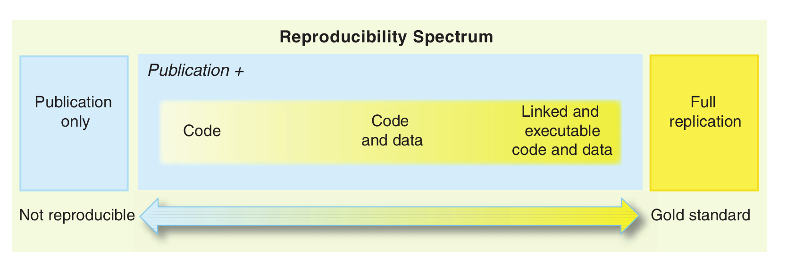
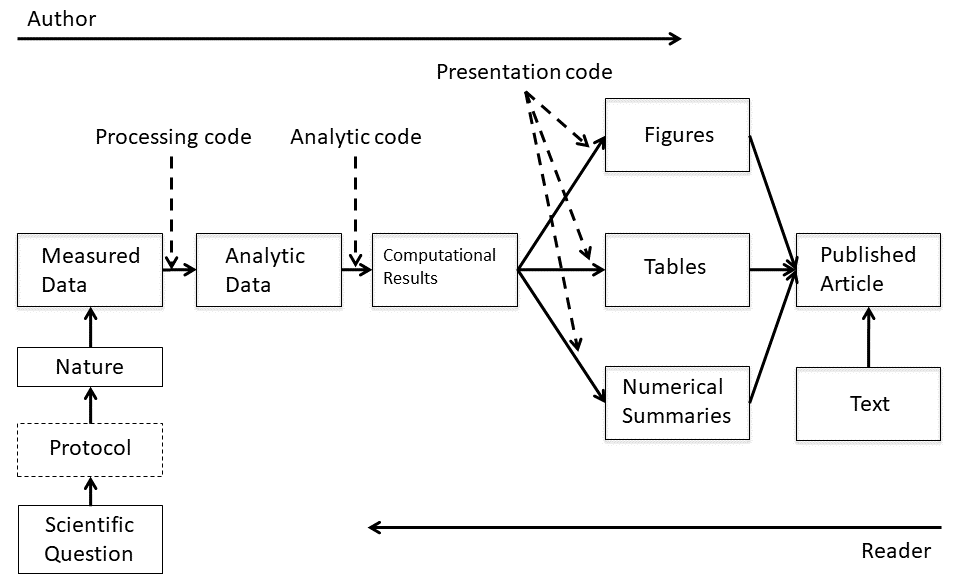
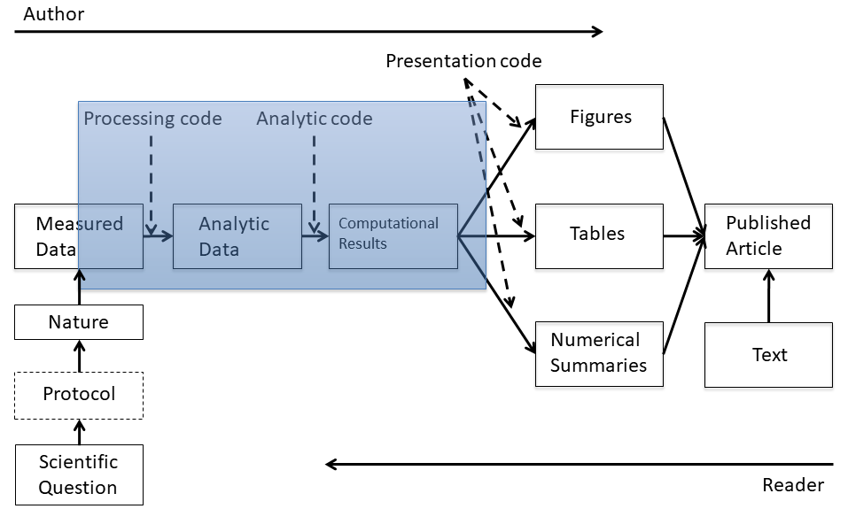
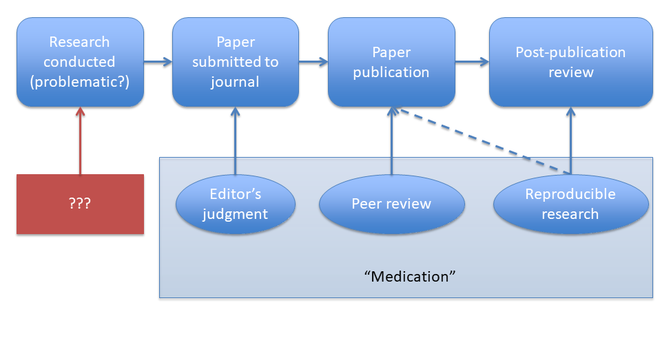
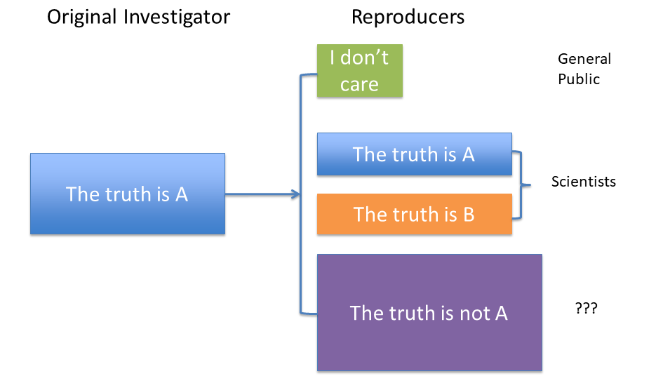
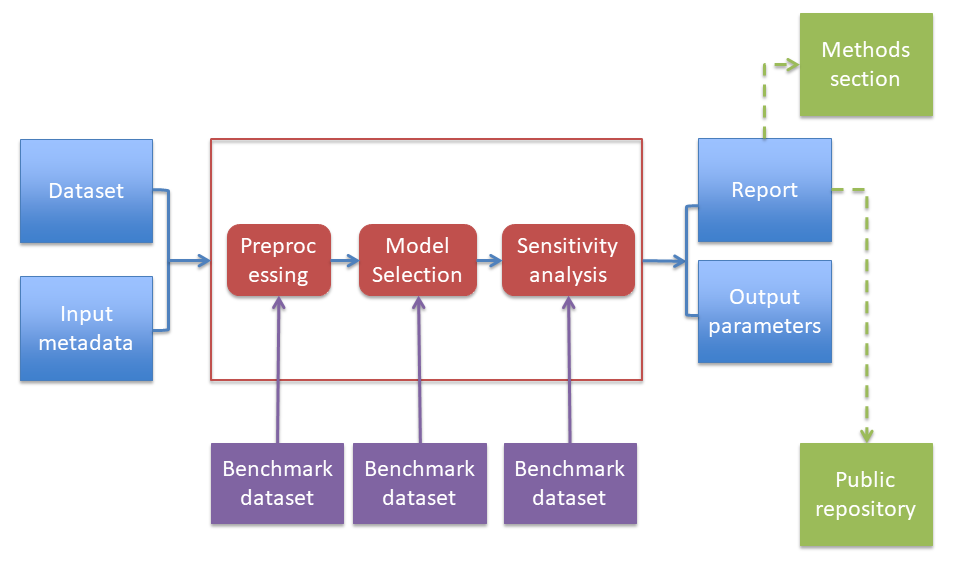

class:center, middle

<iframe width="560" height="315" src="https://www.youtube.com/embed/66oNv_DJuPc" title="YouTube video player" frameborder="0" allow="accelerometer; autoplay; clipboard-write; encrypted-media; gyroscope; picture-in-picture" allowfullscreen></iframe>
-- 

[Funny video about the reality in reproducible science](https://www.youtube.com/watch?v=66oNv_DJuPc)
---

class: center, middle
# Acknowledgements
The contents of this module are based on materials from:

.pull-right[

]
.pull-right[
[Roger D. Peng's materials](https://publichealth.jhu.edu/faculty/1549/roger-d-peng)
]

---
class: inverse, center, middle ## inverse for black color

# Replication and Reproducibility

---
class: center
# Definitions *via* cartoon

---
class: center
# Replication and Reproducibility
.pull-left[
### *Replication*
.left[- Aim to verifying a science claim]
.left[- Question: "Is this claim true?"]
.left[- Gold standard for strengthening scientific evidence]
.left[- New investigators, data, methods, laboratories, *etc.*]
.left[- Important in policy or decision driving studies]
]

.pull-right[
### *Reproducibility*
.left[- Aim to verifying a data analysis   ]
.left[- "Can we trust this analysis?"]
.left[- Arguably a minimum standard for any scientific study]
.left[- New investigators, **same** data, **same** methods]
.left[- Important when replication is impossible]
]

---
class: center, middle

[Reproducible spectrum (Peng 2011)](https://www.science.org/doi/abs/10.1126/science.1213847)
---
class: center
# Background: Underlying Trends

.left[
- Some studies cannot be replicated: no time, no money, Unique/opportunistic

- Technology is increasing data collection throughput; data are more complex and high-dimensional

- Existing databases can be merged to become bigger databases (but data are used off-label)

- Computing power allows more sophisticated analyses, even on "small" data

- For every field "X" there is a "Computational X"
]

---
class: center
# Outstanding problems: Complicated results
.left[
- Even basic analyses are difficult to describe

- Heavy computational requirements are thrust upon people without adequate training in statistics and computing

- Errors are more easily introduced into long analysis pipelines

- Knowledge transfer is inhibited

- Results are difficult to replicate or reproduce

- Complicated analyses cannot be trusted

]

---
class: center
# Data science pipeline

---
class: center
# Reproducible realm

---

class: center
# Out of reproducibility  realm

.left[An analysis can be reproducible and still be wrong.]

.left[We want to know **"can we trust this analysis?"**]

.left[Does requiring reproducibility deter bad analysis?]

--

.pull-left[
### *What we get?*

.left[- Transparency
- Data availability;

- Software / Methods availability;

- Improved transfer of knowledge
]
]

.pull-right[
### *What we do not get?*

.left[- Validity of results;

- Correctness of the analysis
]
]

---
class: center
# Reproducibility assumption
.left[
The premise of reproducible research is that with data/code available, people can check each other and the whole system is self-correcting.

- Addresses the most "downstream" aspect of the research process post-publication;

- Assumes everyone plays by the same rules and wants to achieve the same goals (i.e., scientific discovery).
]
---

class: center
# Reproducibility as preventive measure

---
class: center
# Who reproduces research?
.left[
- For reproducibility to be effective as a means to check validity, someone needs to do something:
  1. Re-run the analysis; 
  
  2. Check results match;
  
  3. Check the code for bugs/errors
]

.left[
- Try alternate approaches; check sensitivity
The need for someone to do something is inherited from traditional notion of replication

- Who is "someone" and what are his/her goals?
]

---
class: center
# Reproducers' map

---
class: center
# Reproducibility story so far
.left[
- Reproducibility brings transparency (wrt code+data) and increased transfer of knowledge;

- A lot of discussion about how to get people to share data;

- Key question of "can we trust this analysis?" is not addressed by reproducibility;

- Reproducibility addresses potential problems long after they've occurred ("downstream");

- Secondary analyses are inevitably coloured by the interests/motivations of others

]
---
class: center
# Evidence-based data analysis
.left[
- Most data analyses involve stringing together many different tools and methods;

- Some methods may be standard for a given field, but others are often applied ad hoc;

- We should apply thoroughly studied (via statistical research), mutually agreed upon methods to analyze data whenever possible;

- There should be evidence to justify the application of a given method

]
---
class: center
# Evidence-based data analysis 2

.left[- Create analytic pipelines from evidence-based components - standardize it;

- [A Deterministic Statistical Machine](http://goo.gl/Qvlhuv);

- Once an evidence-based analytic pipeline is established, we shouldn't mess with it 

      <small> -(Analysis with a "transparent box")</small>;
]

.left[  
- Reduce the "researcher degrees of freedom";

- Analogous to a pre-specified clinical trial protocol.
]

---
class: center
# Desired data analysis map  

---
class: center
# Summary
.left[
- Reproducible research is important, but does not necessarily solve the critical question of whether a data analysis is trustworthy;

- Reproducible research focuses on the most "downstream" aspect of research dissemination;

- Evidence-based data analysis would provide standardized, best practices for given scientific areas and questions;

- Gives reviewers an important tool without dramatically increasing the burden on them;

- More effort should be put into improving the quality of "upstream" aspects of scientific research

]

---

class: center, middle

# Thank you for listening!
Any questions now or email me at [**dossa@xtbg.org.cn**](http://people.ucas.edu.cn/~Dossa?language=en)

Slides created via the R package [**xaringan**](https://github.com/yihui/xaringan).

The chakra comes from [remark.js](https://remarkjs.com), [**knitr**](https://yihui.org/knitr/), and [R Markdown](https://rmarkdown.rstudio.com).
