class: center
# Acknowledgements
The content of this module are based on materials from:

.pull-right[

]
.pull-right[
[olivier gimenez's materials](https://oliviergimenez.github.io/)
]

---
class: center

# What is tidyverse and advantages?
.left[
"A framework for managing data that aims at making the cleaning and preparing steps [muuuuuuuch] easier" (Julien Barnier).
Main characteristics of a tidy dataset:

- the dataset is [tibble](https://tibble.tidyverse.org/);

- measured varaiable as a column;

- an observation represents a row with each value is in a different cell.

[**tidyverse**](https://www.tidyverse.org/) consits of a compilation of r packages for data analysis.
]
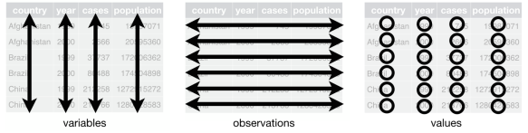
```{r, echo=FALSE,out.width='10%', fig.align='right', fig.cap='', include=TRUE}
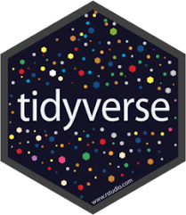
```

---
class: center
# Recognizing a tidy dataset
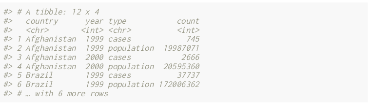


.left[Is this a tidy data?]

--

.left[No]

---
class: center
# Recognizing a tidy dataset
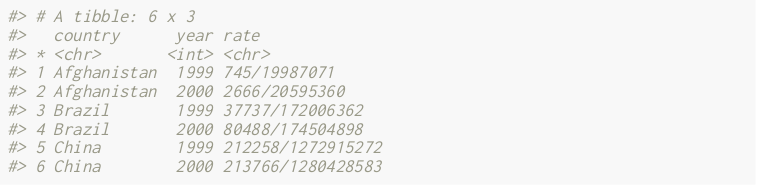


.left[Is this a tidy data?]

--

.left[No]

---
class: center
# Recognizing a tidy dataset
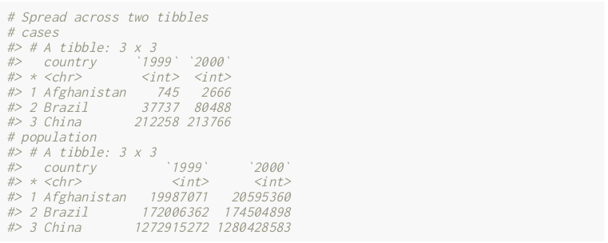


.left[Is this a tidy data?]

--

.left[No]

---
class: center
# Recognizing a tidy dataset
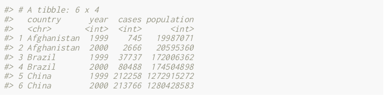


.left[Is this a tidy data?]

--

.left[Yes]

---
class: center

# Tidyverse: Multiple r packages well compiled

.left[Allows using a consistent format for which powerful tools work. 

Makes data manipulation pretty natural

- [ggplot2](https://ggplot2-book.org/) - visualizing stuff;

- [dplyr](https://dplyr.tidyverse.org/), [tidyr](https://tidyr.tidyverse.org/) - data manipulation;

- [purrr](https://purrr.tidyverse.org/) - advanced programming;

- [readr](https://readr.tidyverse.org/) - import data;

- [tibble](https://tibble.tidyverse.org/) - improved data.frame format;

- [forcats](https://forcats.tidyverse.org/) - working with factors;

- [stringr](https://stringr.tidyverse.org/) - working with chain of characters.
]
---
class: center
# Simplified flowchart of data science?
.left[Any data analysis follows this typical flow:
1. Import data;
2. Clean data;
3. Exploratory analysis. A cycle between:
    - Visualization;
    - modeling;
    - Transformation
4. Communicate]
<small>If these steps happen at multiple software then errors are highly inevitable.</small>

```{r, echo=FALSE,out.width='60%', fig.align='center', fig.cap='Reproducibilit equals effecient use of time', include=TRUE, results="hold"}
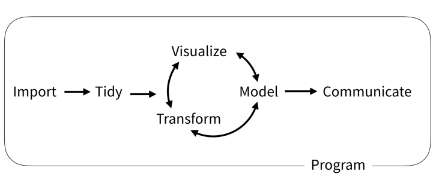
```


---
class: center
# Tidyverse saves: same flowchart in tidyverse
```{r, echo=FALSE,out.width='80%', fig.align='center', fig.cap='Reproducibilit equals effecient use of time', include=TRUE, results="hold"}
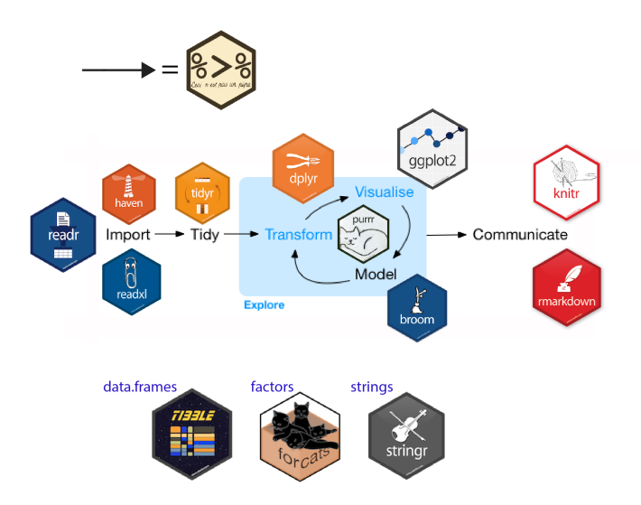
```

---
class: center

# Practice in tidyverse “Use twitter to predict citation rate”

.left[
We will use an existing data supporting the [above publication](https://journals.plos.org/plosone/article?id=10.1371/journal.pone.0166570) to learn some functions within **tidyverse**.
]

---

class: center
# Import data
.left[
readr::read_csv function:

- creates tibbles instead of data.frame;

- no names to rows;

- allows column names with special characters (see next slide);

- more clever on screen display than w/ data.frames (see next slide);

- no partial matching on column names;

- warning if attempt to access unexisting column;

- is incredibly fast.
]

---
class: center

# Import data
.left[
```{r, twittercsv，out.width="80%", message=FALSE, Warnings=FALSE, results="hide"}

# Set the url from where to download the data
url<-"https://doi.org/10.1371/journal.pone.0166570.s001"
# name the file to be downloaded and save as destfile object
destfile <- "twitter_cit_data.csv"
# Apply download.file function in R to download from url
download.file(url, destfile)
library(tidyverse)
# Read the data file with read_csv() and save with name "citations_raw"
citations_raw<-read_csv(file="twitter_cit_data.csv") #<<
head(citations_raw)
```
]
---
class: center

# Import data

.left[
```{r, datoverview，out.width="80%", include=TRUE, Warnings=FALSE, results="hold"}
citations_raw
```
]

---
class: center

# Tidy/transform: Rename columns


.left[
To rename columns, use function *rename()* new_name=old_name

```{r, renamecol}
citations_temp <- rename(citations_raw,
       journal = 'Journal identity',
       impactfactor = '5-year journal impact factor',
       pubyear = 'Year published',
       colldate = 'Collection date',
       pubdate = 'Publication date',
       nbtweets = 'Number of tweets',
       woscitations = 'Number of Web of Science citations')
head(citations_temp,5,6)
```
]

---
class: center

# Tidy: Clean up column names


.left[
To clean columns, use function *clean_names()* from the package janitor from it will fill space in column names by "_".


```{r, cleancol}
janitor::clean_names(citations_raw)
```
]

---
class: center

# Tidy: Create and modify columns
.left[
The well known function to create and modify columns is  *mutate()*, This function takes first the tibble names, the new_name= what you want to do to old column.

```{r, mutatecol,highlight.output=c(2, 3)}
citations <- mutate(citations_temp, journal = as.factor(journal)) 
#Pay attention that I store in "citations"
citations
```
]

---
# Tidy: Create and modify columns
.left[
Check now the levels of journal variable

```{r, levjournal}
levels(citations$journal) 
```
]
---
class: center

# Piping: Make your manipulations easier

Piping was borrowed from other languages (), got incorporated into R after a question in [Pipe question](https://stackoverflow.com/questions/8896820/how-to-implement-fs-forward-pipe-operator-in-r) in 2012.
Pipe which is the bar "|" on your...

---
class: center

# Omelette: Base r approach
You need to do complicated programming: create multiple intermediate objects; embed, needs some understanding of coding and is prone to errors.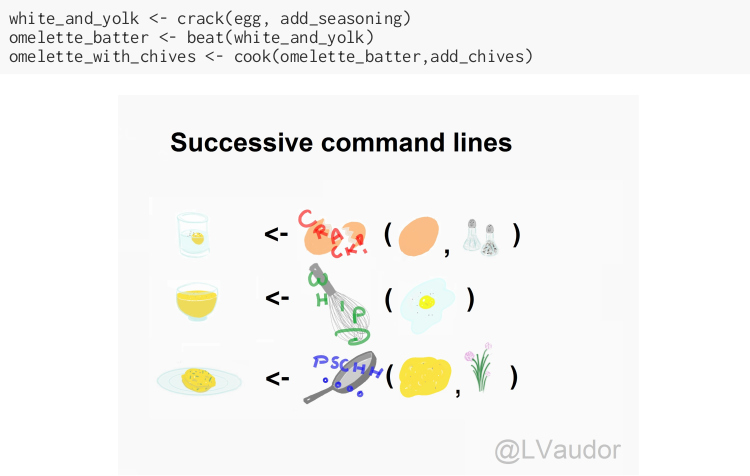

---
class: center
# Omelette: Piping approach
.left[Simpler programming using piping. Piping consists of: taking results from previous function as a starting point of a new function;less prone to errors and consume less memory.
]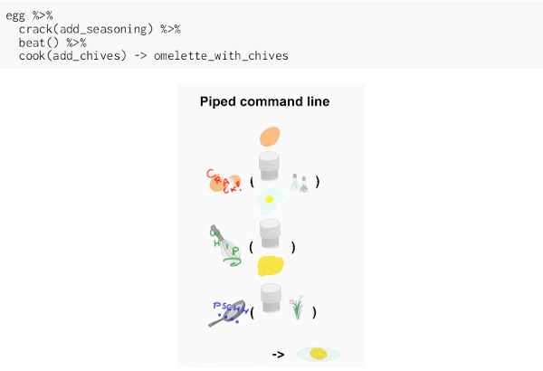

---
class: center
# Example of piping
.left[
Take the tibble "citations_raw" **then** rename some columns then the new tibble containing the renamed tibble and *then* convert the column "journal" from current class ("character") to factor.
```{r,pipeexample, results="hide"}
citations_raw %>%
  rename(journal = 'Journal identity', #<<
       impactfactor = '5-year journal impact factor',
       pubyear = 'Year published',
       colldate = 'Collection date',
       pubdate = 'Publication date',
       nbtweets = 'Number of tweets',
       woscitations = 'Number of Web of Science citations') %>%
  mutate(journal = as.factor(journal)) #<<
```
]
.left[
Please notice every time I say **"then"** this is equal to **"%>%"**. 
]
---
class: center

# Naming final object of pipe
.left[
```{r, namingpipe}
citations <- citations_raw %>% #<<
  rename(journal = 'Journal identity',
       impactfactor = '5-year journal impact factor',
       pubyear = 'Year published',
       colldate = 'Collection date',
       pubdate = 'Publication date',
       nbtweets = 'Number of tweets',
       woscitations = 'Number of Web of Science citations') %>%
  mutate(journal = as.factor(journal))
head(citations)
```
]

---
class: center

# Naming final object of pipe 2
.left[
```{r, namingpipe2}
citations_raw %>% 
  rename(journal = 'Journal identity',
       impactfactor = '5-year journal impact factor',
       pubyear = 'Year published',
       colldate = 'Collection date',
       pubdate = 'Publication date',
       nbtweets = 'Number of tweets',
       woscitations = 'Number of Web of Science citations') %>%
  mutate(journal = as.factor(journal))-> citations2 #<< 
head(citations2) 
```
]

---
class: center

# Pipe synthax
.left[
- *Verb(Subject,Complement)* replaced by *Subject %>% Verb(Complement)*;

- No need to name unimportant intermediate variables;

- Clear syntax (readability).

]
.left[

If you want you can first write what you want to accomplished in a text with "then" as step wise, then code it by replace "then" by the pipe with its operator "%>%" of course.


```{r, echo=FALSE,out.width='10%', fig.align='right', fig.cap='', include=TRUE}
knitr::include_graphics('img/pipinglogo.png')
```

]

---
class: center, middle, inverse
# Other functions in Tidyverse
---
class: center
# Select columns
.left[*select()* is the function one uses to select different variables i a tibble. You just need to remember that it  follows a pipe operator (%>%), and it takes the name of columns one desires to select.
```{r, selectvar}
citations %>%
  select(journal, impactfactor, nbtweets)
```
]

---
class: center
# Drop columns or deselect variables

.left[
The opposite of selecting, which is deselecting. One just need to be more logical in the writing. 
Would you like to guess?
]
--

.left[
```{r, deselectvar}
citations %>%
  select(-Volume, -Issue, -Authors) #<<
```
]

---
class: center
# Split a column in several columns

.left[separate is the function used to split a column into several of course you need to indicate what symbol is the separator (e.g., space, -, /, etc.).
```{r, splitcolum}
head(citations$pubdate)
citations %>%
  select(journal, impactfactor, nbtweets, pubdate)%>%
  separate(pubdate,c('month','day','year'),'/')
```
]
---
class: center

# Transform column in date format
.left[Many of us work with ecological data that record date, and we find it hard to keep these on readable format in R. Within, tidyverse there is a package that specially deals with date formatting variables/columns.
The package is called [**lubridate**](https://lubridate.tidyverse.org/).
```{r, datecolum, message=FALSE}
library(lubridate)
citations %>%
  mutate(pubdate = mdy(pubdate),
         colldate = mdy(colldate))%>%
  select(journal,impactfactor, nbtweets, pubdate, colldate)
```
]
---
class: center
# For easy date format manipulation
.left[Check out ?lubridate::lubridate for more functions

```{r, datecolum2, message=FALSE}
library(lubridate)
citations %>%
  mutate(pubdate = mdy(pubdate),
         pubyear2 = year(pubdate))%>%
  select(journal,impactfactor, pubdate, colldate, pubyear2)
```
]
---

class: center, middle, inverse

# Join tables together

---
class: center

# Join two tables
.left[
Joining tables are the correspondents of merge function in base R.
There is a great tutorial to all sort of joining in tidyverse made available by [Garrick Aden-Buie](https://www.garrickadenbuie.com/project/tidyexplain/).
The joining of tables can be categorized into several types. However, we will only study the following:
- Inner join;

- Left join;

- Right join;

- Semi join;

- Union join;

- Anti join.
]

---
class: center

# Inner join


---
class: center

# Left join


---
class: center

# Right join


---

class: center

# Semi join


---
class: center

# Union join


---
class: center

# Anti join

---
class: center, middle, inverse
# Character manipulation
---
class: center

# Select rows of papers with > 3 authors
.left[
```{r, filterchar}
citations %>%
#str_detect() detect characters in a given column #<<
    filter(str_detect(Authors,'et al')) 
```
]
---
class: center
# Select columns with rows of papers with > 3 authors
.left[
```{r, filter_col}
citations %>%
  filter(str_detect(Authors,'et al')) %>%
  select(Authors)
```
]
---
class: center
# Select columns with rows of papers with < 3 authors
.left[
```{r, filter_col3}
citations %>%
  filter(!str_detect(Authors,'et al')) %>% ##！ for saying "not".
  select(Authors)
```
]
---
class: center
# Select authors of columns with rows of papers with < 3 authors
.left[
```{r, filter_pull}
citations %>%
  filter(!str_detect(Authors,'et al')) %>% ##！ for saying "not".
pull(Authors) %>%
  head(10)
```
]

---
class: center

# Rows of papers with less than 3 authors in journal with IF < 5
.left[
```{r, moreselect}
citations %>%
  filter(!str_detect(Authors,'et al'), impactfactor < 5)
```
]
---
class: center

# Convert words to lowercase
.left[
```{r, changecase}
citations %>%
  mutate(authors_lowercase = str_to_lower(Authors)) %>% #<<
  select(authors_lowercase)
```
]
---
class: center

# Remove all spaces in variable names
.left[
```{r, deletespace}
citations%>%
  mutate(journal = str_remove_all(journal," ")) %>%
  select(journal) %>%
  unique() %>%
  head(5)
```
]
---
class: center, middle, inverse

# Basic exploratory data analysis
---
class: center

# Count ()

This helps to count the number of occurrences.
.left[
```{r, count1}
citations %>% 
  count(journal, sort = TRUE) ## Embedded sorting within count()
```
]
---
class: center
# Count() for multiple variables
.left[
```{r, count2}
citations %>%
  count(journal, pubyear)
```
]
---
class: center
# Count sum of tweets per journal
.left[
```{r, tweetbyjourn}
citations %>%
  count(journal, wt = nbtweets, sort = TRUE)
```
]
---
class: center

# Group variables to compute stats [summarise()]
.left[
```{r, summardata}
citations %>%
  group_by(journal) %>%
  summarise(avg_tweets = mean(nbtweets))
```
]
---
class: center
# Order stuff [arrange()]
.left[
```{r, arrangedesc}
citations %>%
  group_by(journal) %>%
  summarise(avg_tweets = mean(nbtweets)) %>%
  # decreasing order but (without desc for increasing) #<<
  arrange(desc(avg_tweets))-> arrangedat 
head(arrangedat, 10)
```
]

---
class: center
# Work on several columns [dplyr:::across()]

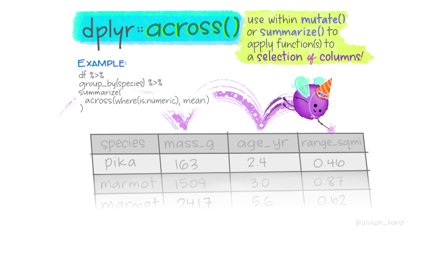
---
class: center

# Compute mean across multiple variables
.left[
```{r, acrossexample}
citations %>%
  group_by(journal) %>%
  summarize(across(where(is.numeric), mean)) #<<
```
]

---
class: center

# Tidying tibbles [wide(), long()]

---
class: center

# Data manipulation with tidyverse: in depth study
.left[
Learn the tidyverse: books, workshops and online courses
Selection of books:
- [R for Data Science](https://www.tidyverse.org/learn/) and [Advanced R](http://adv-r.had.co.nz/);

- [Tidy Tuesdays videos](https://www.youtube.com/user/safe4democracy/videos) by D. Robinson;

- Material of the [stat545](https://stat545.com/) course on Data wrangling, exploration, and analysis with R at the University of British Columbia;

- List of best R packages (with their description) on data import, [wrangling and visualization](https://www.computerworld.com/article/2921176/great-r-packages-for-data-import-wrangling-visualization.html).
]
---
class: center, middle

# Thank you for listening!
Any questions now or email me at [**dossa@xtbg.org.cn**](http://people.ucas.edu.cn/~Dossa?language=en)

Slides created via the R package [**xaringan**](https://github.com/yihui/xaringan).

The chakra comes from [remark.js](https://remarkjs.com), [**knitr**](https://yihui.org/knitr/), and [R Markdown](https://rmarkdown.rstudio.com).
