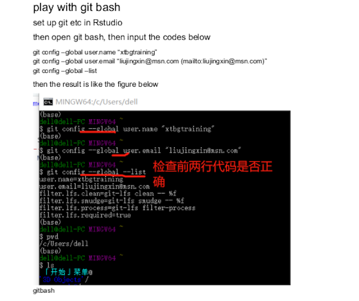
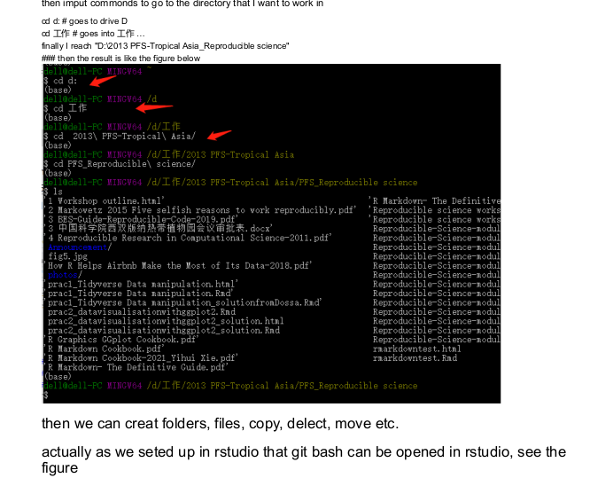
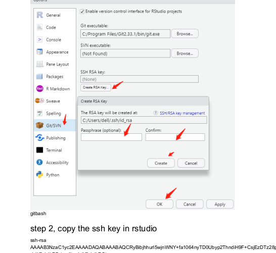
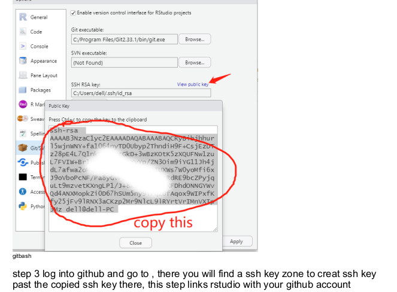
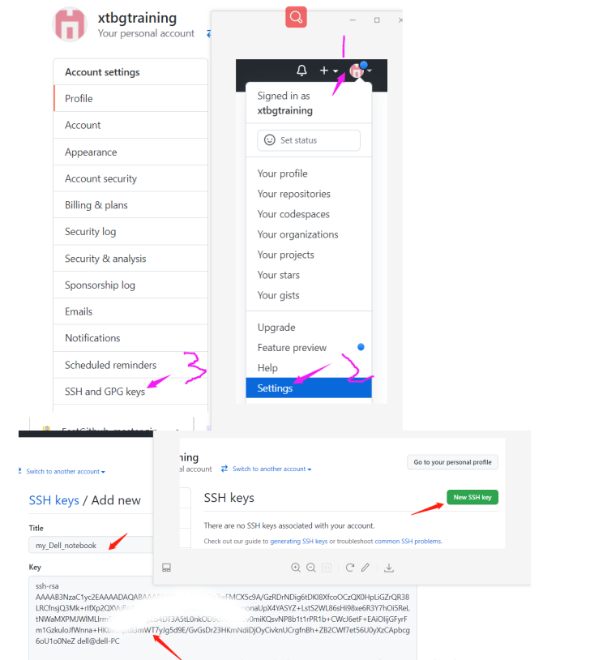
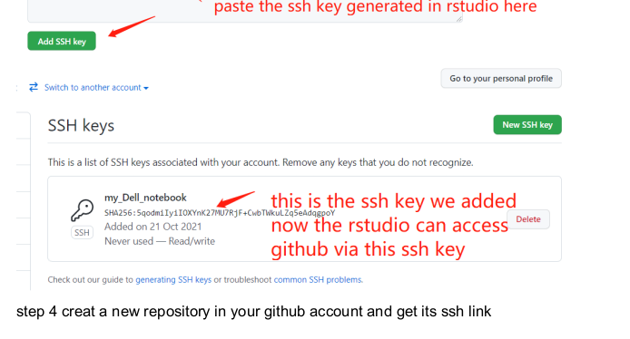
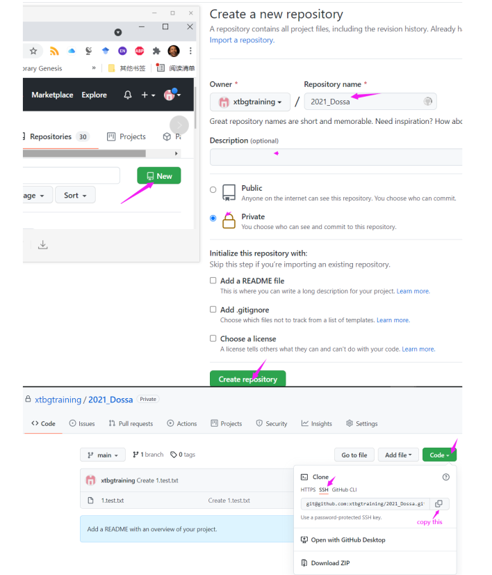
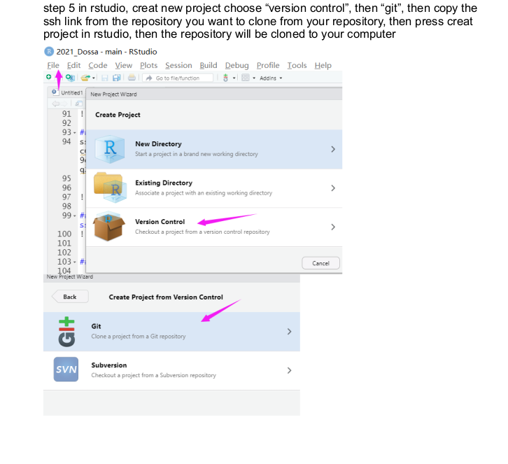
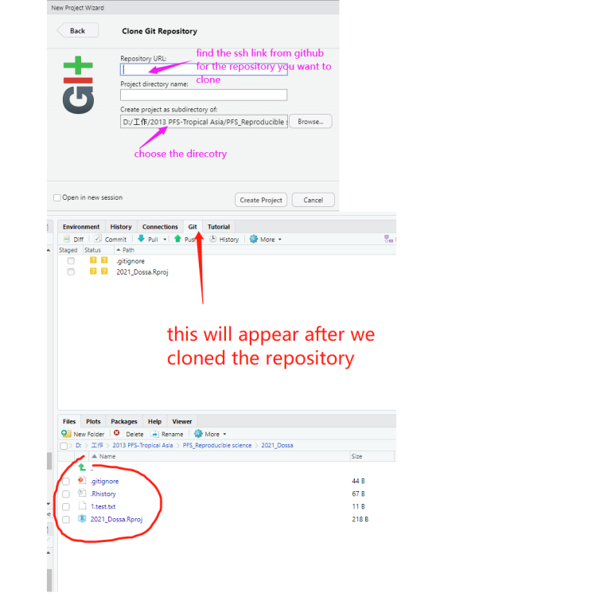

class: center
# Acknowledgements
The content of this module are based on materials from:

.pull-right[

]
.pull-right[
[Rob Schick's materials](https://nicholas.duke.edu/people/staff/schick-phd)
]
---
class: center
# Hard way of doing things is Git Bash
.left[
* Why shall we bother doing it hard?
Simple because if ever R Studio fails, you know an alternative.
The second reason is in presence of conflict you might have only one 
option of doing it by hand.

* I agree that the integration of R git and Github is powerful
]

---
class: center
# Requirements to link Git and Github
.left[
- Set the same email for both Git and Github

- Set the same username (ideally) for both Git and Github

- Make sure you configure R Studio to open Git Bash

- Make sure you connect your computer/R Studio with Github 
  Doing so will not only allow communication between Git and Github but 
  also to allow clicking to automate actions in R studion

]
---
class: center

# How to link your computer to your github **securely**
.left[
You need to set an SSH Key. 

Please follow instructions below.
]

---
class: center
# Setting up git in R Studio

```{r, echo=FALSE,out.width='100%', fig.align='center', fig.cap='', include=TRUE}

```

---
class: center
# Few basic git commands

```{r, echo=FALSE,out.width='100%', fig.align='center', fig.cap='', include=TRUE}

```

---
class: center
# How to create SSH key in R studio step 1
```{r, echo=FALSE,out.width='100%', fig.align='center', fig.cap='', include=TRUE}

```

---
class: center

# How to create SSH key in R studio step 2
```{r, echo=FALSE,out.width='100%', fig.align='center', fig.cap='', include=TRUE}

```

---
class: center

# How to create SSH key in R studio step 3
```{r, echo=FALSE,out.width='100%', fig.align='center', fig.cap='', include=TRUE}

```


---
class: center

# How to create SSH key in R studio step 4
```{r, echo=FALSE,out.width='100%', fig.align='center', fig.cap='', include=TRUE}

```


---
class: center

# How to create a new repository on github 
```{r, echo=FALSE,out.width='100%', fig.align='center', fig.cap='', include=TRUE}

```

---
class: center

# How to clone the repository in R studio
```{r, echo=FALSE,out.width='100%', fig.align='center', fig.cap='', include=TRUE}

```

---
class: center

# How R studio looks like repo is cloned
```{r, echo=FALSE,out.width='100%', fig.align='center', fig.cap='', include=TRUE}

```
---
class: center, middle

# Thank you for listening!
Any questions now or email me at [**dossa@xtbg.org.cn**](http://people.ucas.edu.cn/~Dossa?language=en)

Slides created via the R package [**xaringan**](https://github.com/yihui/xaringan).

The chakra comes from [remark.js](https://remarkjs.com), [**knitr**](https://yihui.org/knitr/), and [R Markdown](https://rmarkdown.rstudio.com).
