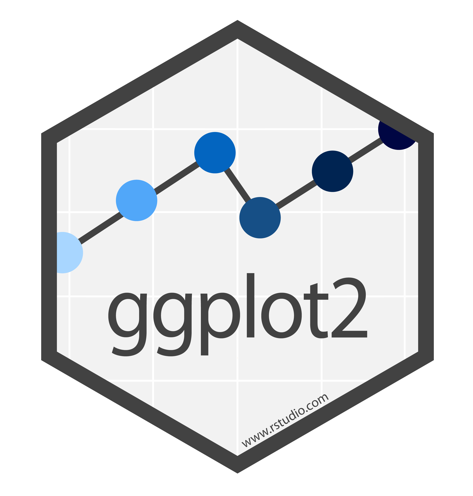
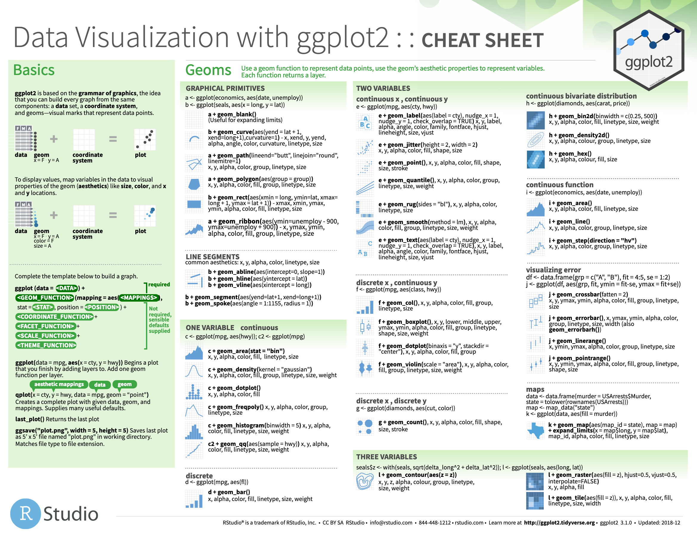
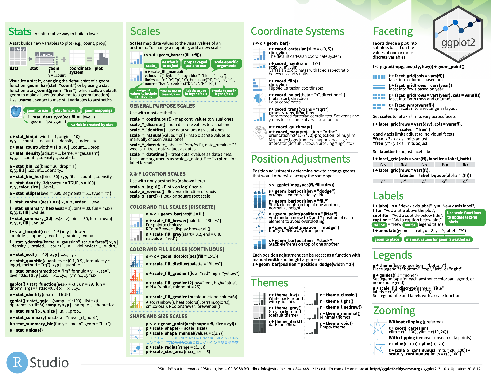

class: center
# Acknowledgements
The content of this module are based on materials from:

.pull-right[

]
.pull-right[
[olivier gimenez's materials](https://oliviergimenez.github.io/)
]

---
class: center

# ggplot2: Introduction
.left[
- This package was created by [Hadley Whickham](http://hadley.nz/) check out its [book](https://ggplot2-book.org/);

- A powerful package for visualizing data;

- The package ggplot2 implements a grammar of graphics;

- Operates on data.frames or tibbles, not vectors like base R;

- Explicitly differentiates between the data and its representation;

- Consists on stacking different layers together, if you have ever worked with GIS, 
then this notion of layer would be familiar to you.
]

```{r, echo=FALSE,out.width='20%', fig.align='center', fig.cap='', include=TRUE}

```

---
class: center

# The ggplot2 grammar


 Grammar element   | What it is
 :---------------- | :-----------------------------
 **Data**          | The data frame being plotted
 **Geometrics**    | The geometric shape that will represent the data
                   | (e.g., point, boxplot, histogram)
 **Aesthetics**    | The aesthetics of the geometric object
                   | (e.g., color, size, shape)

```{r, echo=FALSE,out.width='20%', fig.align='center', fig.cap='', include=TRUE}

```

---
class: center

# ggplot basics

1) The ggplot function and the data argument specify a data frame in the main ggplot function
.left[
<small>
```{r, message=FALSE, results="hide"}
#ggplot(data = df) where df= dataframe or tibble
```
</small>
]

2) The mapping aesthetics, or aes; most importantly, the variable(s) that we want to plot. aes() specify as an embedded argument in the ggplot() function

<small>
.left[
```{r}
# ggplot(data = df, mapping = aes(x = h5_median, y = h5_index, color = subfield))
```
]
</small>

3) The geometric objects, or geom; the visual representations specify, after a plus sign +, as an additional function
<small>
.left[
```{r}
# ggplot(data = df, mapping = aes(x = h5_median, y = h5_index, color = subfield)) + geom_point() #<<

```
]
</small>

---
class: center, middle, inverse
# Examples of plots

---
class: center

# Scatter plots: Import data
.left[
We will continue using the precedent data on how twitting can predict citations.
]
.left[
```{r, twittercsv, message=FALSE, Warnings=FALSE, results="hide"}
# Set the url from where to download the data
url<-"https://doi.org/10.1371/journal.pone.0166570.s001"
# name the file to be downloaded and save as destfile object
destfile <- "twitter_cit_data.csv"
# Apply download.file function in R to download from url
download.file(url, destfile)
library(tidyverse)
# Read the data file with read_csv() and save with name "citations_raw"
citations_raw<-read_csv(file="twitter_cit_data.csv")
citations <- rename(citations_raw,
       journal = 'Journal identity',
       impactfactor = '5-year journal impact factor',
       pubyear = 'Year published',
       colldate = 'Collection date',
       pubdate = 'Publication date',
       nbtweets = 'Number of tweets',
       woscitations = 'Number of Web of Science citations')
```
]
---
class: center
# Scatter plot: Plotting
.left[
```{r, scaterplot,out.width='50%'}
scatterplot<-citations %>%
  ggplot() + #<<
  aes(x = nbtweets, y = woscitations) + #<<
  geom_point() #<<
```
]

--

.left[
- Pass in the data frame as your first argument;
]

--

.left[
- Aesthetics maps the data onto plot characteristics, here x and y axes
]
--

.left[
- Display the data geometrically as points
]

---
class: center
# Scatter plot
.left[
```{r, scaterplot2,out.width='50%'}
scatterplot
```
]

---
class:center
# Scatterplots with colors
.left[
Puts all points in same color.
```{r scattercol,out.width='40%'}
scatter_col<-citations %>%
  ggplot() +
  aes(x = nbtweets, y = woscitations) +
  geom_point(color = "red") #<<
scatter_col
```
]

---
class:center
# Scatterplots with color per species
.left[
Gives different color per species.
```{r scatterspcol,out.width='40%'}
scatter_spcol<-citations %>%
  ggplot() +
  aes(x = nbtweets, y = woscitations, color = journal) + #<<
  geom_point()
scatter_spcol
```
]

---
class:center
# Scatterplots with shape per journal
.left[
Gives different shape per journal.
First need to pick few journals.
Let's do journal on ecology.
Filiter these journals to three: JAE, JAppE, Ecol.
```{r citations_ecology}
citations_ecology <- citations %>%
  mutate(journal = str_to_lower(journal)) %>% # all journals names lowercase
  filter(journal %in%
           c('journal of animal ecology','journal of applied ecology','ecology')) # filter
head(citations_ecology)
```
]

---
class:center
# Scatterplots with shape per journal
.left[
Gives different shape per journal.

```{r fewjournals,out.width='40%'}
scatter_ecol<-citations_ecology %>%
  ggplot() +
  aes(x = nbtweets, y = woscitations, shape = journal) +
  geom_point(size=2)
scatter_ecol
```
]

---
class:center
# Scatterplots with lines not points
.left[
By now, you would guess this requires change in geom, so this should intuitively geom_line.
```{r scatterline,out.width='30%', message=FALSE, warning=FALSE}
scatter_line<-citations_ecology %>%
  ggplot() +
  aes(x = nbtweets, y = woscitations) +
  geom_line() + #<<
  scale_x_log10()
scatter_line
```
]

---
class: center

# Scatterplots with sorting then add line
.left[
```{r scatterline2,out.width='30%', message=FALSE, warning=FALSE}
scatter_line2<-citations_ecology %>%
  arrange(woscitations) %>% #<<
  ggplot() +
  aes(x = nbtweets, y = woscitations) +
  geom_line() +
  scale_x_log10()
scatter_line2
```
]
---
class: center

# Scatterplots with line and points
.left[
```{r scatterline3,out.width='30%', message=FALSE, warning=FALSE}
scatter_line3<-citations_ecology %>%
  arrange(woscitations) %>% 
  ggplot() +
  aes(x = nbtweets, y = woscitations) +
  geom_line() +
  geom_point() + #<<
  scale_x_log10()
scatter_line3
```
]
---
class: center

# Scatterplots with trend line
.left[
```{r scatterline4,out.width='30%', message=FALSE, warning=FALSE}
scatter_line4<-citations_ecology %>%
  arrange(woscitations) %>% 
  ggplot() +
  aes(x = nbtweets, y = woscitations) +
  geom_point() +
  geom_smooth(method = "lm") +#<<
  scale_x_log10()
scatter_line4
```
]

---
class: center

# Scatterplots with smoother
.left[
```{r scatterline5,out.width='30%', message=FALSE, warning=FALSE}
scatter_line5<-citations_ecology %>%
  arrange(woscitations) %>% 
  ggplot() +
  aes(x = nbtweets, y = woscitations) +
  geom_point() +
  geom_smooth() + #<<
  scale_x_log10()
scatter_line5
```
]

---
class: center
# aes or not aes?
.left[Before continuing to other type of plots, let break to see what we mean by aes().

- If we are to establish a link between the values of a variable and a graphical feature, 
ie a mapping, then we need an aes().

- Otherwise, the graphical feature is modified irrespective of the data, then we do not need an aes().
]

---
class: center
# Histograms 
.left[
When you only provide x in the aes(), then ggplot will render a histogram.
```{r histogram,out.width='30%', message=FALSE, warning=FALSE}
histo<-citations_ecology %>%
  ggplot() +
  aes(x = nbtweets) + #<<
  geom_histogram()
histo
```

]

---
class: center
# Histograms with bars in colors
.left[
```{r histogram2,out.width='30%', message=FALSE, warning=FALSE}
histo2<-citations_ecology %>%
  ggplot() +
  aes(x = nbtweets) + 
  geom_histogram(fill = "orange") #<<
histo2
```
]
---
class: center
# Histograms with bars filled and contour colors
.left[
```{r histogram3,out.width='30%', message=FALSE, warning=FALSE}
histo3<-citations_ecology %>%
  ggplot() +
  aes(x = nbtweets) + 
  geom_histogram(fill = "orange", color="orange") #<<
histo3
```
]
---
class: center
# Histograms with labels and title
.left[
```{r histogram4,out.width='30%', message=FALSE, warning=FALSE}
histo4<-citations_ecology %>%
  ggplot() +
  aes(x = nbtweets) + 
  geom_histogram(fill = "orange", color="orange")+
  labs(x = "Number of tweets", #<<
       y = "Count", #<<
       title = "Histogram of the number of tweets") #<<
histo4
```
]

---
class: center
# Histograms but group this by specific variable
.left[
Here we want to have the histogram by journal.
```{r, histogram5,out.width='30%', message=FALSE, warning=FALSE}
histo5<-citations_ecology %>%
  ggplot() +
  aes(x = nbtweets) +
  geom_histogram(fill = "orange", color = "brown") +
  labs(x = "Number of tweets",
       y = "Count",
       title = "Histogram of the number of tweets") + 
  facet_wrap(vars(journal)) #<<
histo5
```
]
---
class: center
# Boxplots
.left[
Intuitively by now, you would guess this would have something like geom_boxplot().
Also, please keep in mind that we would not give x values for the aes(), but only y values.
]
.left[
```{r, boxplot,out.width='30%', message=FALSE, warning=FALSE}
boxpl<-citations_ecology %>%
  ggplot() +
  aes(x = "", y = nbtweets) +
  geom_boxplot(fill="green") + #<<
  scale_y_log10()
boxpl
```
]

---
class: center, middle, inverse
# Some other manipulations
---
class: center
# Boxplots
.left[
```{r message=FALSE, warning=FALSE, paged.print=FALSE, out.width = '350cm', out.height='350cm',  fig.align = "center"}
citations_ecology %>%
  ggplot() +
  aes(x = "", y = nbtweets) +
  geom_boxplot() + #<<
  scale_y_log10()
```
]
---
class: center
# Boxplots with colors
.left[
```{r message=FALSE, warning=FALSE, paged.print=FALSE, out.width = '350cm', out.height='350cm',  fig.align = "center"}
citations_ecology %>%
  ggplot() +
  aes(x = "", y = nbtweets) +
  geom_boxplot(fill = "green") + #<<
  scale_y_log10()
```
]
---
class: center
# Boxplots with colors by species
.left[
```{r message=FALSE, warning=FALSE, paged.print=FALSE, out.width = '300cm', out.height='300cm',  fig.align = "center"}
citations_ecology %>%
  ggplot() +
  aes(x = journal, y = nbtweets, fill = journal) + #<<
  geom_boxplot() +
  scale_y_log10()
```
]

---
class: center
# Get rid of the ticks on x axis
.left[
```{r message=FALSE, warning=FALSE, paged.print=FALSE, out.width = '300cm', out.height='300cm',  fig.align = "center"}
citations_ecology %>%
  ggplot() +
  aes(x = journal, y = nbtweets, fill = journal) +
  geom_boxplot() +
  scale_y_log10() + 
  theme(axis.text.x = element_blank()) + #<<
  labs(x = "") #<<
```
]

---
class: center
# Boxplots, user-specified colors by species
.left[
```{r message=FALSE, warning=FALSE, paged.print=FALSE, out.width = '300cm', out.height='300cm',  fig.align = "center"}
citations_ecology %>%
  ggplot() +
  aes(x = journal, y = nbtweets, fill = journal) +
  geom_boxplot() +
  scale_y_log10() +
  scale_fill_manual( #<<
    values = c("red", "blue", "purple")) + #<<
  theme(axis.text.x = element_blank()) +
  labs(x = "")

```
]
---
class: center
# Boxplots, change legend settings
.left[
```{r message=FALSE, warning=FALSE, paged.print=FALSE, out.width = '270cm', out.height='270cm',  fig.align = "center"}
citations_ecology %>%
  ggplot() +
  aes(x = journal, y = nbtweets, fill = journal) +
  geom_boxplot() +
  scale_y_log10() +
  scale_fill_manual( #<<
    values = c("red", "blue", "purple"),
    name = "Journal name", #<<
    labels = c("Ecology", "J Animal Ecology", "J Applied Ecology")) + #<<
  theme(axis.text.x = element_blank()) +
  labs(x = "")
```
]

---
class: center
# Ugly bar plots
.left[
```{r message=FALSE, warning=FALSE, paged.print=FALSE, out.width = '350cm', out.height='350cm',  fig.align = "center"}
citations %>%
  count(journal) %>%
  ggplot() +
  aes(x = journal, y = n) +
  geom_col() #<<
```
]
---
class: center
# Idem, with flipping
.left[
```{r message=FALSE, warning=FALSE, paged.print=FALSE, out.width = '350cm', out.height='350cm',  fig.align = "center"}
citations %>%
  count(journal) %>%
  ggplot() +
  aes(x = n, y = journal) + #<<
  geom_col()
```
]

---
class: center
# Idem, with factors reordering and flipping
.left[
```{r message=FALSE, warning=FALSE, paged.print=FALSE, out.width = '350cm', out.height='350cm',  fig.align = "center"}
citations %>%
  count(journal) %>%
  ggplot() +
  aes(x = n, y = fct_reorder(journal, n)) + #<<
  geom_col()
```
]

---
class: center
# Further cleaning
.left[
```{r message=FALSE, warning=FALSE, paged.print=FALSE, out.width = '350cm', out.height='350cm',  fig.align = "center"}
citations %>%
  count(journal) %>%
  ggplot() +
  aes(x = n, y = fct_reorder(journal, n)) +
  geom_col() + 
  labs(x = "counts", y = "")
```
]

---

# More about how to (tidy) work with factors 

* [Be the boss of your factors](https://stat545.com/block029_factors.html) and 
* [forcats, forcats, vous avez dit forcats ?](https://thinkr.fr/forcats-forcats-vous-avez-dit-forcats/).


---
class: center
# Density plots
.left[
```{r message=FALSE, warning=FALSE, paged.print=FALSE, out.width = '350cm', out.height='350cm',  fig.align = "center"}
citations_ecology %>%
  ggplot() +
  aes(x = nbtweets, fill = journal) +
  geom_density() +#<<
  scale_x_log10()
```
]
---
class: center
# Density plots, control transparency
.left[
```{r message=FALSE, warning=FALSE, paged.print=FALSE, out.width = '350cm', out.height='350cm',  fig.align = "center"}
citations_ecology %>%
  ggplot() +
  aes(x = nbtweets, fill = journal) +
  geom_density(alpha = 0.5) +#<<
  scale_x_log10()
```
]
---
class: center
# Change default background 
.left[
```{r message=FALSE, warning=FALSE, paged.print=FALSE, out.width = '300cm', out.height='300cm',  fig.align = "center"}
# `B & W theme`
citations_ecology %>%
  ggplot() +
  aes(x = nbtweets, fill = journal) +
  geom_density(alpha = 0.5) +
  scale_x_log10() +
  theme_bw() #<< 
```
]
---
class: center
# Change default background theme 
.left[
```{r message=FALSE, warning=FALSE, paged.print=FALSE, out.width = '300cm', out.height='300cm',  fig.align = "center"}
# `classic theme`
citations_ecology %>%
  ggplot() +
  aes(x = nbtweets, fill = journal) +
  geom_density(alpha = 0.5) +
  scale_x_log10() +
  theme_classic() #<< 
```
]
---
class: center
# Change default background theme 
.left[
```{r message=FALSE, warning=FALSE, paged.print=FALSE, out.width = '300cm', out.height='300cm',  fig.align = "center"}
# `dark theme`
citations_ecology %>%
  ggplot() +
  aes(x = nbtweets, fill = journal) +
  geom_density(alpha = 0.5) +
  scale_x_log10() +
  theme_dark() #<<
```
]


---
class: center
# More on data visualisation with ggplot2

.left[
- [Portfolio](https://www.r-graph-gallery.com/portfolio/ggplot2-package/) of ggplot2 plots]

.left[
- [Cedric Scherer's portfolio](https://cedricscherer.netlify.app/top/dataviz/) of data visualizations]

.left[
- [Top](http://r-statistics.co/Top50-Ggplot2-Visualizations-MasterList-R-Code.html) ggplot2 visualizations]

.left[
- [Interactive](https://dreamrs.github.io/esquisse/) ggplot2 visualizations]

```{r echo=FALSE, out.width = "30%", fig.align="center"}
 # ggplot2_logo.jpg
```


---
class: center
# To dive deeper in data visualisation with the tidyverse


- .left[[Learn the tidyverse](https://www.tidyverse.org/learn/): books, workshops and online courses]

- .left[[R for Data Science](https://r4ds.had.co.nz/) and [Advanced R](http://adv-r.had.co.nz/)]

- .left[[Fundamentals of Data visualization](https://clauswilke.com/dataviz/)]

- .left[[Data Visualization: A practical introduction](http://socviz.co/)]

- .left[[Tidy Tuesdays videos](https://www.youtube.com/user/safe4democracy/videos) by D. Robinson] 

- .left[Material of the [2-day workshop Data Science in the tidyverse](https://github.com/cwickham/data-science-in-tidyverse) held at the RStudio 2019 conference]

- .left[
Material of the stat545 course on [Data wrangling, exploration, and analysis with R](https://stat545.com/) at the University of British Columbia]

---
class: center
# The [RStudio Cheat Sheets](https://www.rstudio.com/resources/cheatsheets/)

```{r echo=FALSE, message=FALSE, warning=FALSE, paged.print=FALSE, out.width = "90%", fig.align = "center"}
 #assets/img/ggplot1.png
```

---
class: center
# The [RStudio Cheat Sheets](https://www.rstudio.com/resources/cheatsheets/)

```{r echo=FALSE, message=FALSE, warning=FALSE, paged.print=FALSE, out.width = "90%", fig.align = "center"}
 #assets/img/ggplot2.png
```

---
class: center, middle

# Thank you for listening!

Any questions now or email me at [**dossa@xtbg.org.cn**](http://people.ucas.edu.cn/~Dossa?language=en)

Slides created via the R package [**xaringan**](https://github.com/yihui/xaringan).

The chakra comes from [remark.js](https://remarkjs.com), [**knitr**](https://yihui.org/knitr/), and [R Markdown](https://rmarkdown.rstudio.com).
