class: center, middle
# Acknowledgements
The content of this module are based on materials from:

.pull-right[

]
.pull-right[
[Roger D. Peng's materials](https://publichealth.jhu.edu/faculty/1549/roger-d-peng)
]

---
class: center
# Problems
.left[
- Authors must undertake considerable effort to put data/results on the web

- Readers must download data/results individually and piece together which data go with which code sections, etc.
- Authors/readers must manually interact with websites

- There is no single document to integrate data analysis with textual representations; i.e. data, code, and text are not linked

]

---
class: center
# Literate statistical Programming
.left[
- Original idea comes from Don Knuth

- An article is a stream of text and code

- Analysis code is divided into text and code "chunks"

- Presentation code formats results (tables, figures, etc.)

- Article text explains what is going on

- Literate programs are weaved to produce human-readable documents and tangled to produce machine-readable documents
]

---
class:center

# Literate Statistical Programming

.left[
* Literate programming is a general concept. We need
  
  - A documentation language

  - A programming language

* The original Sweave system developed by Friedrich Leisch used LaTeX and R

* knitr supports a variety of documentation languages
]

---
class: center
# When to decide to work reproducibly?
.left[

- Decide to do it (ideally from the start)

- Keep track of things, perhaps with a version control system to track snapshots/changes [later in the workshop]

- Use software whose operation can be coded [R]

- Don't save output [R]

- Save data in non-proprietary formats
]

---
class: center
# Literate programming: Pros
.left[
- Text and code all in one place, logical order

- Data, results automatically updated to reflect external changes

- Code is live--automatic "regression test" when building a document

]
---
class: center

# Literate programming: Cons
.left[
- Text and code all in one place; can make documents difficult to read, especially if there is a lot of code

- Can substantially slow down processing of documents (although there are tools to help)
]

---
class: center
# Knitr: Definition & usages
.left[
* An R package written by Yihui Xie (while he was a grad student at Iowa State)
 
   - Available on CRAN

* Supports RMarkdown, LaTeX, and HTML as documentation languages

* Can export to PDF, HTML, Word

* Built right into RStudio for your convenience
]

---
class: center

# Knitr: Requirements
.left[
- A recent version of R

- A text editor (the one that comes with RStudio is okay)

- Some support packages also available on CRAN

- Some knowledge of Markdown, LaTeX, or HTML

- We will use Markdown here

]

---
class: center

# What is Markdown?
.left[

- A simplified version of "markup" languages

- No special editor required

- Simple, intuitive formatting elements

- Complete information available at http://goo.gl/MUt9i5
]

---
class: center

# What is knitr good For?
.left[
- Writing manuals/manuscript

- Short/medium-length technical documents

- Tutorials

- Reports (esp. if generated periodically)

- Data preprocessing documents/summaries
]

---
class: center

# What is knitr not good for?
.left[
- Very long research articles

- Complex time-consuming computations

- Documents that require precise formatting & complicated formatting
]

---
class: center

# How to create knitr document
```{r echo=FALSE, message=FALSE, warning=FALSE, paged.print=FALSE, out.width = "90%", fig.align = "center"}
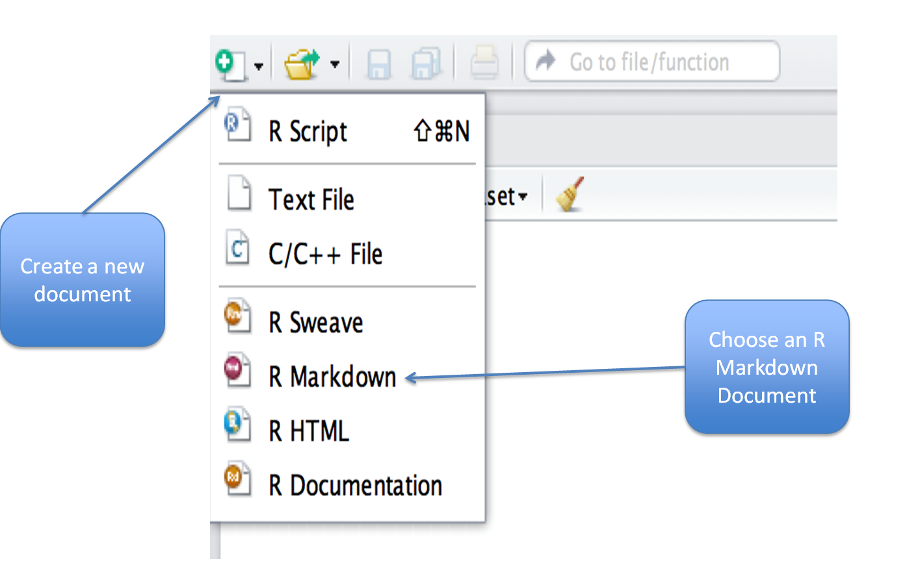
```

---
class: center
# First knitr document as example
```{r echo=FALSE, message=FALSE, warning=FALSE, paged.print=FALSE, out.width = "90%", fig.align = "center"}
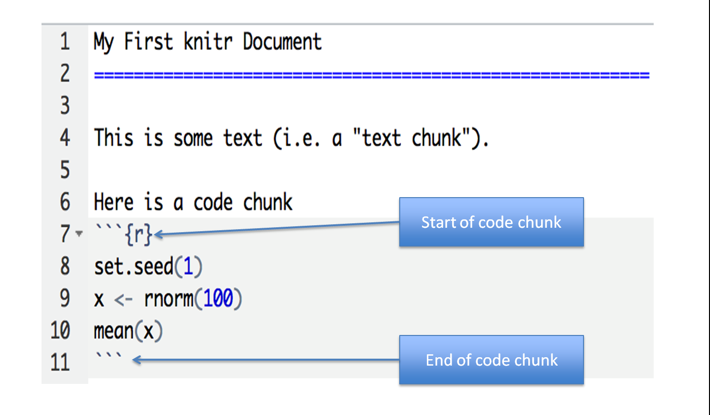
```
---
class: center
# Processing a knitr document: one click
```{r echo=FALSE, message=FALSE, warning=FALSE, paged.print=FALSE, out.width = "90%", fig.align = "center"}
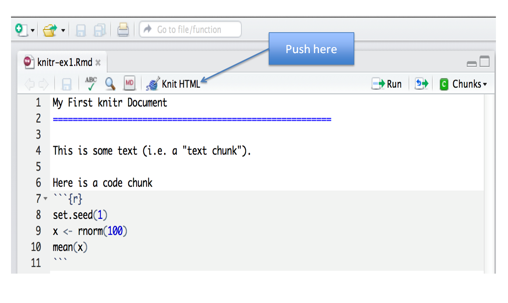
```

---
class: center
# Processing a knitr document: one click
.left[
- library(knitr)setwd(<working directory>)

- knit2html(“document.Rmd”)

- browseURL(“document.html”)

]
---
class: center
# Knitr to HTML Output
```{r echo=FALSE, message=FALSE, warning=FALSE, paged.print=FALSE, out.width = "90%", fig.align = "center"}
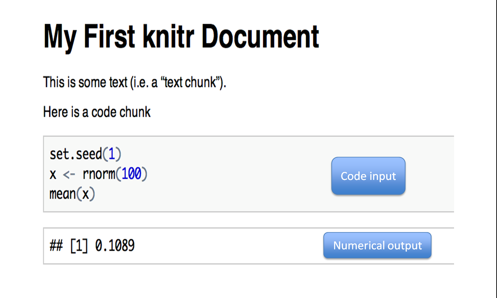
```

---
class: center
# What knitr produces: Markdown
```{r echo=FALSE, message=FALSE, warning=FALSE, paged.print=FALSE, out.width = "90%", fig.align = "center"}
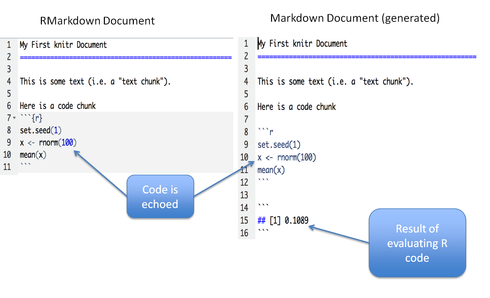
```

---
class:center
# A few notes
.left[
- knitr will fill a new document with filler text; delete it

- Code chunks begin with ```{r} and end with ```

- All R code goes in between these markers

- Code chunks can have names, which is useful when we start making graphics```{r firstchunk}## R code goes here```

- By default, code in a code chunk is echoed, as will the results of the computation (if there are results to print)
]

---
class: center
# Processing of knitr Documents (behind the hood)
.left[
- You write the RMarkdown document (.Rmd)

- knitr produces a Markdown document (.md)

- knitr converts the Markdown document into HTML (by default)
.Rmd --> .md -->.html

- You should NOT edit (or save) the .md or .html documents until you are finished

]

---
class: center
# Another Example

```{r echo=FALSE, message=FALSE, warning=FALSE, paged.print=FALSE, out.width = "90%", fig.align = "center"}
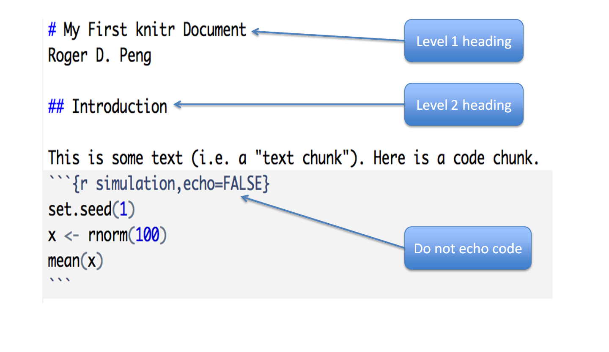
```
---
class: center
# Output

```{r echo=FALSE, message=FALSE, warning=FALSE, paged.print=FALSE, out.width = "90%", fig.align = "center"}
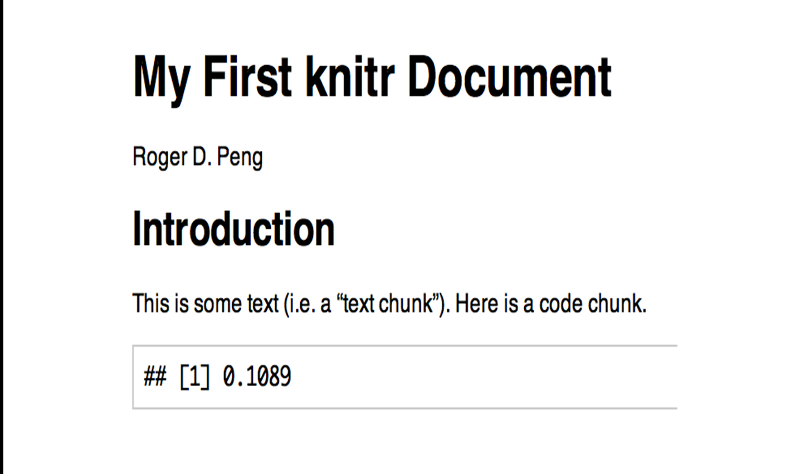
```

---
class: center
# Hiding Results

```{r echo=FALSE, message=FALSE, warning=FALSE, paged.print=FALSE, out.width = "90%", fig.align = "center"}
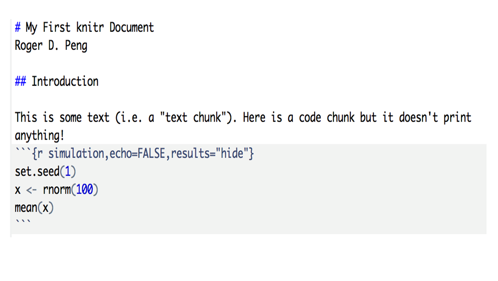
```

---
class: center
# Output
```{r echo=FALSE, message=FALSE, warning=FALSE, paged.print=FALSE, out.width = "90%", fig.align = "center"}
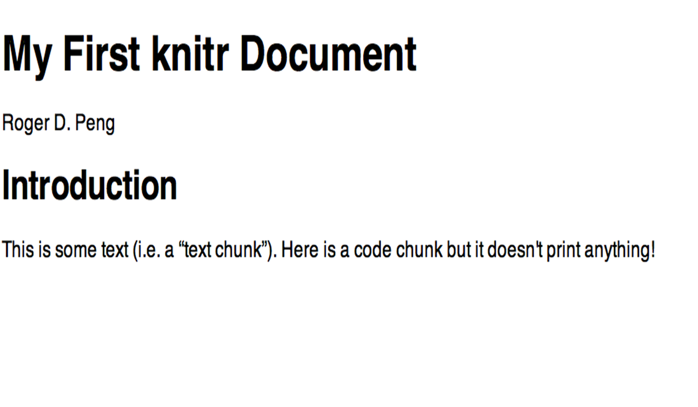
```

---
class: center
# Inline Text Computations
```{r echo=FALSE, message=FALSE, warning=FALSE, paged.print=FALSE, out.width = "90%", fig.align = "center"}
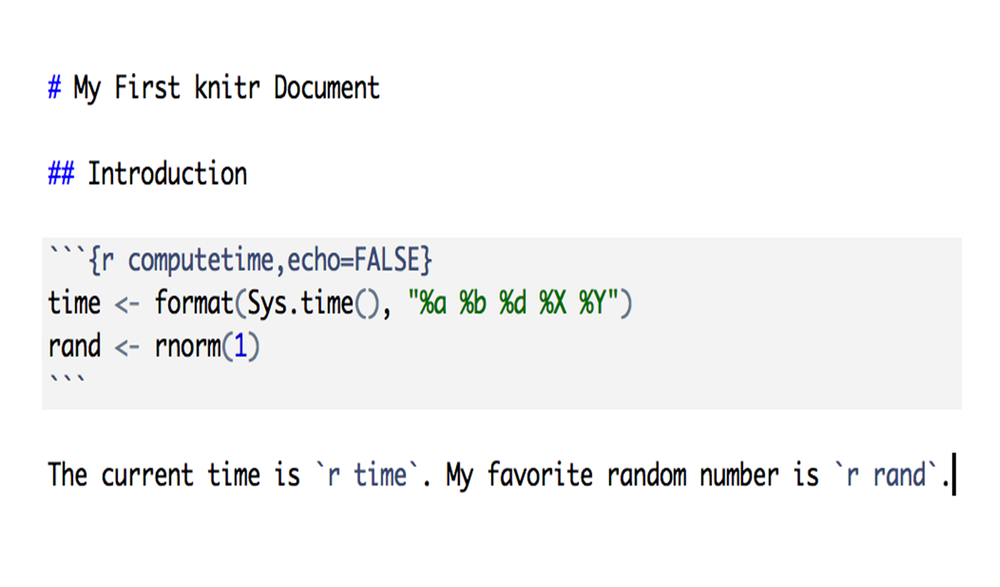
```

---
class: center
# Inline Text Computations (output)

```{r echo=FALSE, message=FALSE, warning=FALSE, paged.print=FALSE, out.width = "90%", fig.align = "center"}
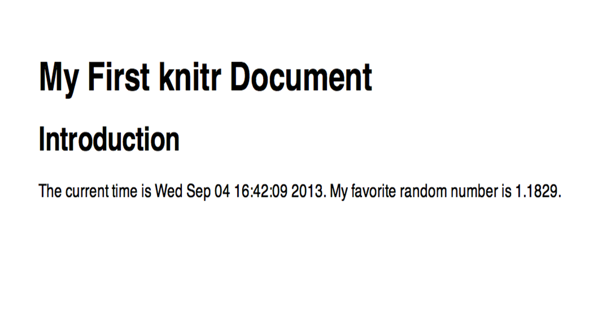
```

---
class: center

# Incorporating Graphics
```{r echo=FALSE, message=FALSE, warning=FALSE, paged.print=FALSE, out.width = "90%", fig.align = "center"}
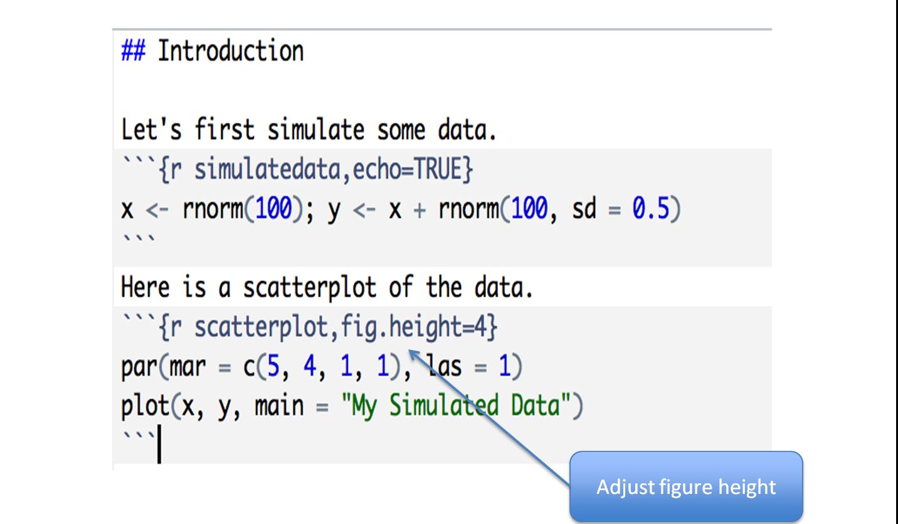
```

---
class: center

# What knitr Produces in HTML
```{r echo=FALSE, message=FALSE, warning=FALSE, paged.print=FALSE, out.width = "90%", fig.align = "center"}
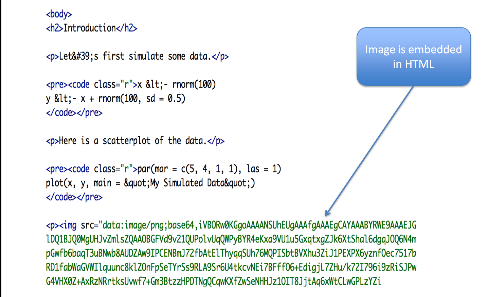
```

---
class: center
# Incorporating Graphics
```{r echo=FALSE, message=FALSE, warning=FALSE, paged.print=FALSE, out.width = "90%", fig.align = "center"}
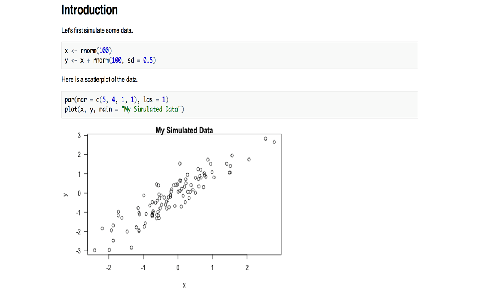
```

---
class: center
# Making Tables with xtable
```{r echo=FALSE, message=FALSE, warning=FALSE, paged.print=FALSE, out.width = "90%", fig.align = "center"}
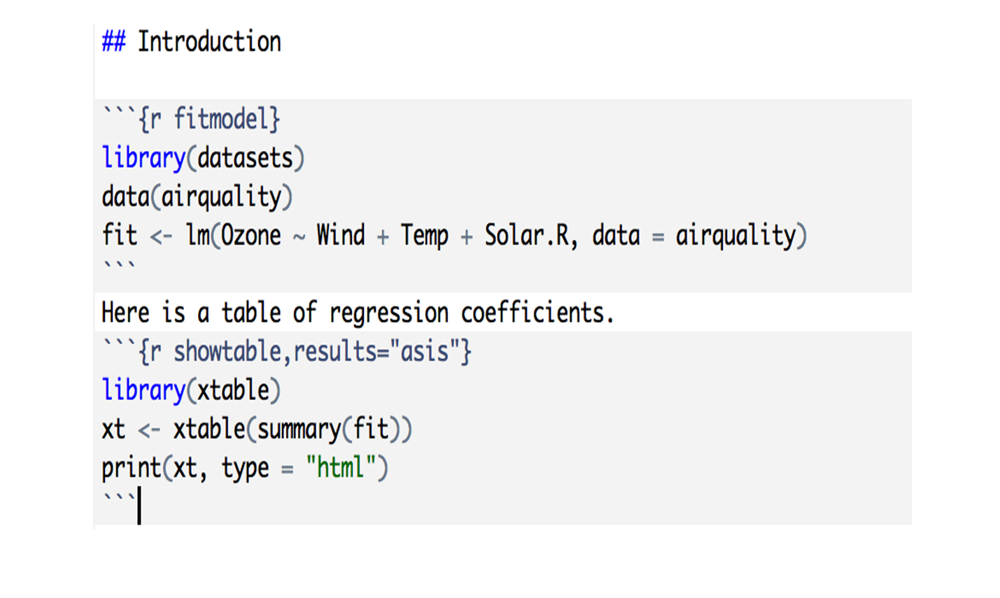
```

---
class: center

# Making Tables with xtable (output)
```{r echo=FALSE, message=FALSE, warning=FALSE, paged.print=FALSE, out.width = "90%", fig.align = "center"}
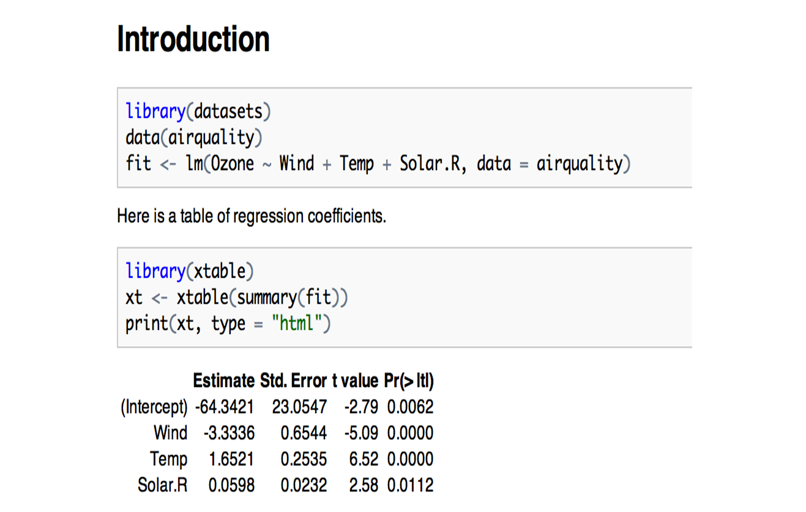
```

---
class: center

# Setting Global Options
.left[

- Sometimes we want to set options for every code chunk that are different from the defaults

- For example, we may want to suppress all code echoing and results output

- We have to write some code to set these global options

]
---
class: center
# Setting Global Options

```{r echo=FALSE, message=FALSE, warning=FALSE, paged.print=FALSE, out.width = "90%", fig.align = "center"}
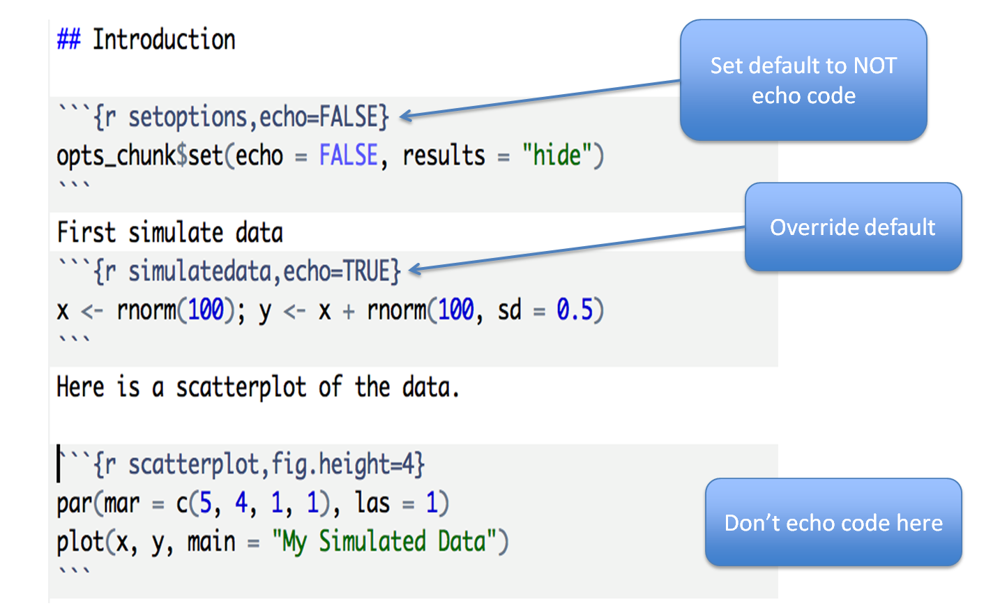
```

---
class: center

# Setting Global Options (output)

```{r echo=FALSE, message=FALSE, warning=FALSE, paged.print=FALSE, out.width = "90%", fig.align = "center"}
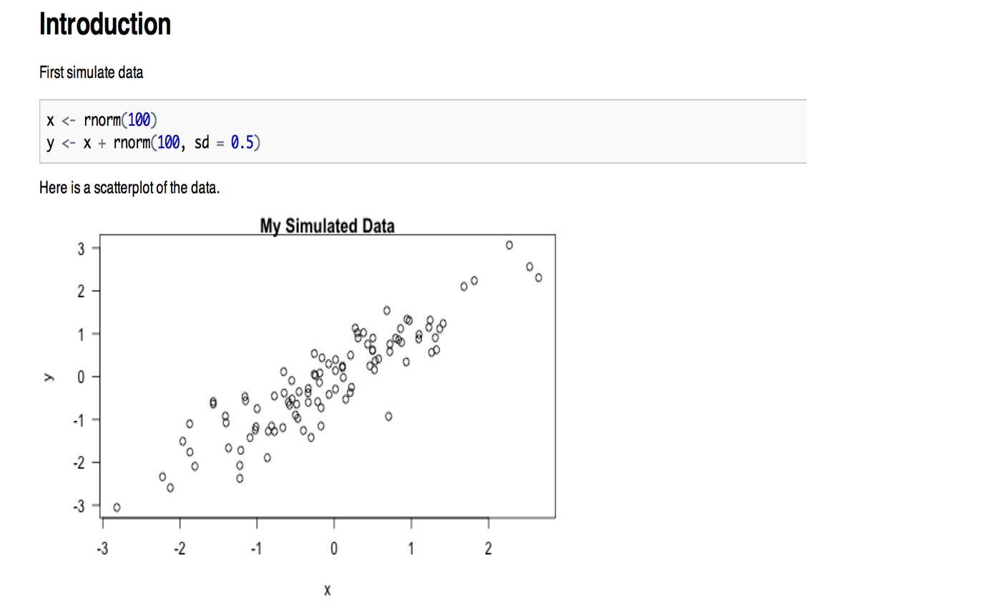
```

---
class: center

# Some common options
.left[
- Output
    
    + results: “asis”, “hide”
    
    + echo: TRUE, FALSE

- Figures

    + fig.height: numeric

    + fig.width: numeric

]

---
class: center

# Caching computation

.left[

- What if one chunk takes a long time to run?

- All chunks have to be re-computed every time you re-knit the file

- The cache=TRUE option can be set on a chunk-by-chunk basis to store results of computation

- After the first run, results are loaded from cache

]

---
class: center
# Caching caveats
.left[
- If the data or code (or anything external) changes, you need to re-run the cached code chunks

- Dependencies are not checked explicitly

- Chunks with significant side effects may not be cacheable
]

---
class: center

# summary

.left[

- Literate statistical programming can be a useful way to put text, code, data, output all in one document

- knitr is a powerful tool for integrating code and text in a simple document format

]
---
class: center, middle

# Thank you for listening!
Any questions now or email me at [**dossa@xtbg.org.cn**](http://people.ucas.edu.cn/~Dossa?language=en)

Slides created via the R package [**xaringan**](https://github.com/yihui/xaringan).

The chakra comes from [remark.js](https://remarkjs.com), [**knitr**](https://yihui.org/knitr/), and [R Markdown](https://rmarkdown.rstudio.com).
